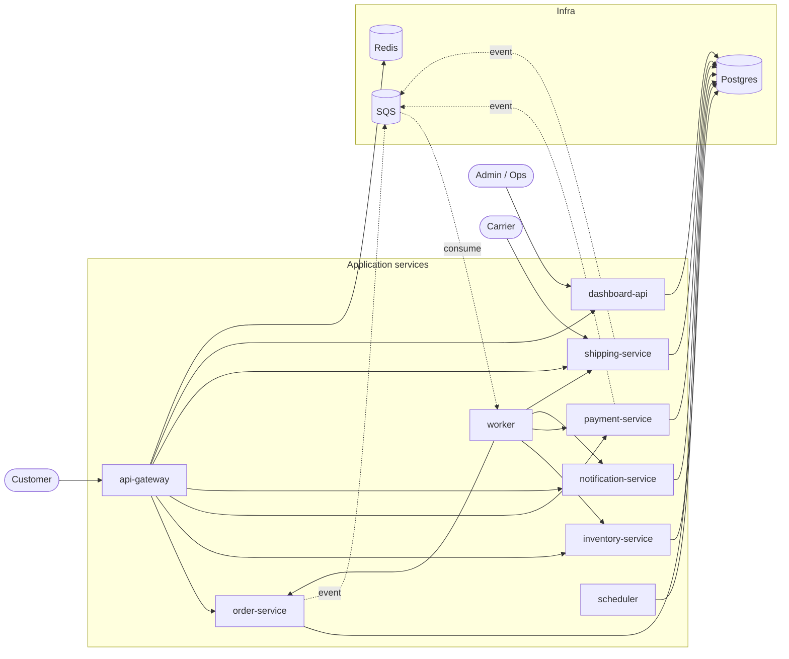

# Episode 2: The nine services and their containers

## Need for this episode

This is EP2. We tour the nine Go services that make up the platform. For each one we look at what it does, what it talks to and what is in its Dockerfile. The point is to know what we are about to put on EKS before we start putting it there.

We are not rewriting any Dockerfile today. Every service ships with one already. They are deliberately rough so we can poke at them. What we want is a clear picture of:

- What each service does in one sentence
- What it talks to (Postgres, Redis, SQS, other services)
- What is in its Dockerfile and where it differs from the rest
- The one or two things in that Dockerfile that bite us when we move to EKS

By the end you should be able to point at any of the nine services and say "this one becomes a Deployment, this one a StatefulSet client, this one wants IRSA for SQS, this one is the only Pod that needs Ingress". Most of those words are explained in Appendix A at the bottom. Stick with us.

---

## Monolith vs microservices: why we have nine of these

A **monolith** is one binary that does everything. It handles HTTP requests, processes payments, sends emails, runs cron jobs. One repo, one deploy, one container, one place to look at logs. It is simple to reason about, until it is not.

A **microservices** setup splits that up. Each service does one job. Orders live in one service. Payments live in another. Notifications live in a third. They are independent processes that talk to each other over the network.

This platform has nine of them. Here is why that matters and what it costs us.

### What we get by splitting it up

**Independent scaling.** When Black Friday hits, we want 20 replicas of `order-service` to handle the traffic. We do not need 20 replicas of `notification-service`, because email volume scales on a different curve. In a monolith, you scale the whole thing or nothing. In microservices, each one scales on its own signal: order-service on CPU, worker on SQS queue depth, dashboard-api hardly at all.

**Independent deploys.** A bad release of `payment-service` does not take the order page down. The api-gateway and order-service keep running on the previous version of payments. We can roll back just the broken service in seconds. In a monolith, every deploy is a full-app deploy and every rollback is a full-app rollback.

**Smaller blast radius for change.** A bug in the dashboard query code cannot crash the worker that processes SQS. They are different processes in different containers in different Pods. If one crashes, K8s restarts that one. The other eight do not notice.

**Teams move at their own pace.** In a real org, the payments team might deploy four times a day. The notifications team deploys once a week. Microservices let them work on their own clock. A monolith forces everyone onto the same release train.

### What it costs us

**More moving parts.** Nine services means nine Dockerfiles, nine sets of probes, nine sets of metrics. Most of the rest of this series is about managing that complexity sensibly.

**Network calls fail.** What was a function call in a monolith is now an HTTP request that can time out, return a 500 or get killed mid-flight. Every service needs sensible timeouts, retries with backoff and idempotent handlers. This is the bit teams underestimate when they migrate to microservices.

**Observability gets harder.** Debugging "why was this order rejected?" is one stack trace in a monolith. Here it might involve four services. We need centralised logging plus distributed tracing (one trace ID that follows the request through every service) to keep our sanity. We come back to this later.

### How our nine services actually talk to each other

The whole platform on one page. Solid arrows are synchronous HTTP. Dotted arrows are asynchronous SQS events.



**A single order from start to finish.** Reading the diagram above, here is what actually happens when one customer places one order:

1. Customer sends `POST /api/orders` to api-gateway with a JWT in the header
2. api-gateway verifies the JWT and applies the Redis rate limit, then proxies the request to order-service
3. order-service writes a `pending` row to the `orders` table in Postgres and publishes an `order.created` event to SQS. It returns `201 Created` to the customer straight away. As far as the customer is concerned, the order is placed
4. Meanwhile, worker is long-polling SQS in the background. It picks up the `order.created` event a moment later
5. worker fans the event out over HTTP: it calls inventory-service to reserve stock, payment-service to charge, notification-service to email the customer and shipping-service to create a shipment label
6. Each of those services updates its own tables in Postgres. Some of them publish their own follow-up events back to SQS (`payment.processed`, `shipment.created`)
7. worker picks those follow-up events up too and updates the order via order-service, marching it through pending → confirmed → processing → shipped → delivered
8. Separately, scheduler runs on tickers in the background: expiring abandoned reservations every minute, retrying failed payments every 15 minutes, sending daily digests every hour and cleaning up old events every 30 minutes
9. dashboard-api reads from Postgres on demand to render summaries for the admin UI

That is the whole platform doing one transaction. Every box in the diagram has a part to play.

Three patterns to take from that picture. You can see all three in the compose file too.

**Synchronous HTTP.** One service calls another over HTTP and waits for the answer. The api-gateway calls order-service to create an order. order-service calls inventory-service to check stock. These are blocking calls. If the callee is slow, the caller is slow. If the callee is down, the caller has to handle that gracefully.

**Asynchronous events via SQS.** When order-service finishes creating an order, it publishes an event to SQS and returns to the caller immediately. The worker picks up that event later and tells the inventory, payment, notification and shipping services about it. The original caller does not wait. This decouples "an order was placed" (fast) from "an email was sent" (can take a few seconds and we do not care if it takes 10).

**Shared state via the database.** Some services read the same tables. The dashboard-api reads from orders, payments and shipments to build a single summary view. This is fine for reads. It is dangerous for writes, which is why each table has exactly one service that is allowed to write to it (the "owning" service).

In Kubernetes those three patterns become:

- Synchronous HTTP between services → a K8s `Service` object per app, with a stable cluster-internal DNS name like `order-service.default.svc`
- Async via SQS → IRSA roles on the publisher and the consumer, plus a Dead Letter Queue for failures
- Shared database → one Postgres Pod on a StatefulSet, each service holding its own connection pool

### Why each service has its own Dockerfile

Because each one is built, versioned and rolled out independently. If order-service ships a new feature, only its image rebuilds, only its tag changes, only its Pods get replaced. The other eight stay on whatever version was last known to be good.

The Dockerfiles look almost identical here because every service in our platform happens to be a Go HTTP process. In a polyglot system you would see a Python service with a `python:3.12-slim` base, a Rust service with `rust:1.84`, a Node service with `node:22-alpine`. Each Dockerfile is the contract for what that one service needs to run. Keeping them separate is what makes "independent deploys" actually work.

---

## The baseline they all share

Every service in `platform/services/` ships an identical Dockerfile:

```dockerfile
FROM golang:1.26-alpine
WORKDIR /app
COPY . .
RUN go mod download
RUN go build -o /app/service .
CMD ["/app/service"]
```

We will harden it later in the series when we add things like probes (Kubernetes' way of checking a Pod is alive and ready), resource limits and a `securityContext` (rules about what user the container runs as). For today we leave it alone and focus on what is inside the binary, because that is the bit each service does differently.

The four things every service has in common at runtime:

- **`/livez`** is a 200 OK with no body. "The process is alive." Kubernetes uses this for the **liveness probe**, which restarts the Pod if it fails
- **`/healthz`** is a JSON status that also checks dependencies (Postgres, Redis are reachable). K8s uses this for the **readiness probe**, which stops sending traffic to the Pod if it fails (but does not restart it)
- All config comes from environment variables. There are no config files anywhere
- All of them handle `SIGTERM` (the signal K8s sends when it wants a Pod to stop) and run a 30-second graceful shutdown so in-flight requests can finish

Hold those four points in your head. Each one maps to an EKS feature: liveness and readiness probes, ConfigMaps + Secrets, `terminationGracePeriodSeconds` (how long K8s waits before force-killing a Pod), the cluster's log shipper that picks up everything written to stdout.

Now the tour. Each service gets a few minutes. Same shape every time so the pattern sticks.

---

## 1. api-gateway (port 8080)

**What it does.** The single front door for the customer-facing app. It handles login and register, signs JWT tokens, applies rate limits and forwards requests to the right internal service.

**What it talks to.**
- Redis, for rate-limiting counters. Optional. The service still works if Redis is down, it just stops rate-limiting
- Every other HTTP service in the platform, via env vars like `ORDER_SERVICE_URL`, `INVENTORY_SERVICE_URL`

**Dockerfile note.** Identical to the other eight. The binary is small. The only extra dependencies are `go-redis` and `golang-jwt`. No special build flags.

**What bites in EKS.**
- This is **the only Pod the public internet ever touches** on the customer-facing side. Later in the series we put Traefik (the Ingress controller) and an AWS NLB (Network Load Balancer) in front of it, plus cert-manager for the HTTPS cert
- The `JWT_SECRET` env var is currently the string `local-dev-secret` from `docker-compose.yml`. In EKS that has to come from AWS Secrets Manager via External Secrets. If that secret leaks, anyone can forge a user session
- `REDIS_URL` will change from `redis://redis:6379` (the compose service name) to `redis://redis-0.redis.default.svc:6379` once Redis is on a StatefulSet. That long DNS name is the stable address of the Redis Pod inside the cluster
- This Pod is the obvious candidate for HPA on CPU. If traffic doubles, we want twice as many api-gateway Pods.

---

## 2. order-service (port 8081)

**What it does.** Owns the `orders` table. It runs the order state machine: pending → confirmed → processing → shipped → delivered. It publishes events to SQS whenever the state changes.

**What it talks to.**
- Postgres (its own `orders` and `order_events` tables)
- SQS (via `SQS_QUEUE_URL`, pointed at LocalStack in compose)
- No direct HTTP calls to other services. It communicates with them by publishing events

**Dockerfile note.** Identical. The interesting bit is what runs at startup, not what builds.

**What bites in EKS.**
- **Runs migrations on startup.** Open `main.go` and look at the `migrate()` call. It runs `CREATE TABLE IF NOT EXISTS` and a couple of indexes before the HTTP server starts. With one replica this is fine. With three replicas booting cold, all three race to create the same tables. Postgres usually copes, but it is sloppy. Later in the series we move migrations into a dedicated Kubernetes `Job` (a Pod that runs once per release) so this happens exactly once, not three times
- `db.SetMaxOpenConns(25)`. Every replica opens up to 25 connections to Postgres. Three replicas of nine services that all do this is roughly 675 connections to a single Postgres Pod. That will blow up. We cap it later
- The `publishEvent` function will need IRSA to talk to real SQS. In compose we use fake AWS keys (`AWS_ACCESS_KEY_ID=test`). In EKS the Pod gets a real IAM role via IRSA with permission to call `sqs:SendMessage` on exactly one queue
- The state-machine logic is in a Go `map` in memory. No cache, no leader. That means we can run as many replicas as we want, they all behave the same.

---

## 3. inventory-service (port 8082)

**What it does.** Tracks stock levels per SKU. Handles reservations (a temporary hold on stock with a TTL). This is the bit that stops us selling the same last unit to two customers.

**What it talks to.**
- Postgres only (`products` and `reservations` tables)
- Nothing else directly. It is called by `order-service` (synchronously, over HTTP) and by the worker (when SQS events fire)

**Dockerfile note.** Identical.

**What bites in EKS.**
- **The reservation logic has a race condition.** If two replicas both receive `POST /reserve` for the last unit at the same moment, both might succeed. In production this needs either a Redis-based distributed lock or a Postgres row-level lock (`SELECT ... FOR UPDATE`, which tells Postgres "nobody else can touch this row until I'm done"). The current code uses the latter loosely. We come back to the SQL together later
- Same migration-on-startup pattern as `order-service`. Same fix later
- This service is read-heavy: most calls are "what is the stock of product X". When we build dashboards later in the series, it is the first one to get a cache-hit ratio panel.

---

## 4. payment-service (port 8083)

**What it does.** Processes charges and refunds. Maintains the ledger. Today it is fake: `math/rand` gives a 90% success rate. The shape of the code is real, the processing is not.

**What it talks to.**
- Postgres (`payments` and `ledger` tables)
- SQS (publishes `payment.processed` and `payment.failed` events)
- In real life, a payment provider like Stripe. We stub it.

**Dockerfile note.** Identical.

**What bites in EKS.**
- This is the **most sensitive Pod in the cluster**. Its IRSA role should be the tightest of any service: `sqs:SendMessage` on one specific queue ARN, nothing else. That boundary matters and we will draw it carefully later
- `math/rand` is fine for a teaching demo. In a real system it would never come near a payment path because it is not cryptographically safe. Worth saying out loud so nobody copies this pattern home
- Ledger writes need to be transactional with payment status updates. Look at the SQL: one `BEGIN ... COMMIT`. Later in the series we will run a drill: kill the Pod between the two writes and see what state the database is left in.

---

## 5. notification-service (port 8084)

**What it does.** Sends emails and SMS. Stores message templates. Logs delivery history. Today it is mocked. Every "send" just inserts a row into the database. No real provider is called.

**What it talks to.**
- Postgres (`notifications`, `templates`)
- In real life: SMTP for email (typically AWS SES) and an SMS provider (SNS or Twilio). Today: stubs.

**Dockerfile note.** Identical.

**What bites in EKS.**
- This is the service that **needs egress most badly**. Egress means a Pod making an outbound connection to the public internet. We will talk about killing the NAT Gateway to save money later in the series. NAT is what lets Pods make those outbound connections. Without it, the cluster cannot reach external SMTP or Twilio. We can work around this for AWS-native services (SES, SNS) by using VPC endpoints (a private route from the VPC to an AWS API), but a third-party provider like Twilio still needs the NAT
- SMTP credentials, API keys for the SMS provider, all of these live in AWS Secrets Manager and arrive in the Pod via External Secrets
- In a real outage (emails back up overnight because the SMTP provider is slow), this service becomes the "noisy neighbour" that hogs Postgres connections and starves everyone else. Alerts on this come later in the series.

---

## 6. shipping-service (port 8085)

**What it does.** Creates shipments. Tracks them. Receives webhooks from carriers (a `POST /webhook` that DHL or UPS would call when a parcel changes status).

**What it talks to.**
- Postgres (`shipments`, `tracking_events`)
- SQS (publishes shipment status changes for the worker to act on)
- In real life: carrier APIs (DHL, UPS, Royal Mail). Stubbed today.

**Dockerfile note.** Identical.

**What bites in EKS.**
- The `/webhook` endpoint is the **second Pod that needs to be reachable from the public internet**, because couriers POST to it. When we wire the Ingress for this path later, it has to be tighter than the main app: only allow IPs from known carrier networks, authenticate every request via a shared HMAC signature
- Webhooks are at-least-once. The same idempotency lesson as the worker applies: the handler must be safe to call twice with the same payload
- Outbound calls to carrier APIs hit the same NAT-or-no-NAT question as notification-service. We come back to it.

---

## 7. scheduler (no main port, health on :8091)

**What it does.** Background cron jobs. Five of them: expire abandoned reservations every minute, detect abandoned carts every 5 minutes, retry failed payments every 15 minutes, generate digests every hour, clean up old events every 30 minutes.

**What it talks to.**
- Postgres only (reads and writes)
- Indirectly: writes to tables that other services consume

**Dockerfile note.** Identical, but the runtime shape is different. Open `main.go`. There is no main HTTP server. The service is just goroutines on Go tickers, plus a tiny health server on port 8091 so probes have something to hit.

**What bites in EKS.** This is the most interesting one.

- **You cannot run two of these.** Two scheduler Pods means every cron job fires twice. Duplicate reservations expired twice, duplicate digests sent twice. There are two ways out:
  - Keep it as a Deployment with `replicas: 1` and `strategy: Recreate` (which means "kill the old Pod first, then start a new one" instead of the default rolling update). Simple. Has a few seconds of downtime during deploys
  - Move each interval job into a Kubernetes `CronJob`. Each tick spawns a fresh Pod that runs once and dies. K8s handles the schedule, there is no long-running process to keep at one replica. This is the production-grade answer and we land on it later
- Health port 8091 is the only port to probe. There is no app port to expose in the Pod spec
- `db.SetMaxOpenConns(5)`. Only 5 connections because nothing else routes through this Pod. Worth knowing for the connection-budget calculation later.

---

## 8. worker (no main port, health on :8090)

**What it does.** Long-polls SQS, then fans events out to the other services over HTTP. The async glue that ties the platform together.

**What it talks to.**
- SQS (consumes messages)
- Every other HTTP service in the platform (calls them to act on events)
- **No Postgres connection.** This is the only service in the platform without one

**Dockerfile note.** Identical, but again the runtime shape is different. No main HTTP port. Small health server on 8090. No database wait at startup because there is no database to wait for.

**What bites in EKS.**
- **HPA on CPU is wrong here.** An idle worker uses almost no CPU. Scaling it on CPU does nothing useful. The right answer is KEDA with the SQS scaler: "if the queue depth is over 100 messages, add a Pod; if it is empty for 5 minutes, remove one." We bring KEDA in later
- SQS is at-least-once. Every handler in this worker must be idempotent. If `order.created` arrives twice, we must not create two orders. The current handlers are roughly idempotent (they call HTTP endpoints that themselves check for duplicates) but not airtight. We will tighten this up
- The DLQ is the thing nobody thinks about until messages start landing in it. Later in the series we wire up a CloudWatch alarm: "if DLQ depth > 0 for 5 minutes, page someone." Without that alarm, failed messages pile up silently
- IRSA for the worker is the **biggest of the nine** in terms of permissions it needs. It reads from the main queue (`sqs:ReceiveMessage`), deletes messages it has processed (`sqs:DeleteMessage`) and queries queue metadata (`sqs:GetQueueAttributes`). All of those plus the same on the DLQ for inspection. Still scoped to exactly those two queues by ARN, but it is the longest IAM policy in the cluster.

---

## 9. dashboard-api (port 8086)

**What it does.** The admin UI plus a JSON API that backs it. Order stats, revenue charts, low-stock alerts, shipping overview. The thing engineers and ops staff look at.

**What it talks to.**
- Postgres (read-mostly, cross-table queries)
- Some endpoints indirectly call other services, but most just read the database directly because it is faster

**Dockerfile note.** Identical on paper. **Different in practice.** Open `main.go` and look at the top:

```go
//go:embed static
var staticFiles embed.FS
```

`//go:embed` is a Go directive that bakes the entire `static/` folder (HTML, CSS, JavaScript) into the compiled binary at build time. So even though the Dockerfile looks the same as every other service, this binary is the only one that contains a UI inside it. We do not need a separate `COPY static ./static` in the Dockerfile. Go does it at compile time and the binary serves the files from memory.

This is a small but important point: **a template Dockerfile works here because the language handles the variation for us**. If the UI were a separate `dist/` folder served by a Node process, the Dockerfile would need its own runtime stage with the static files copied across. Because it is Go with `embed`, it does not.

**What bites in EKS.**
- The UI being baked into the binary means we can rebuild and roll the dashboard with the same pattern as every other service: build new image, tag with the git SHA, update the manifest. No separate frontend artefact, no CDN to invalidate
- This is the **third Pod that needs public reach**. Engineers and ops land on it through Ingress. The hostname is different from the customer-facing api-gateway (probably `admin.<domain>` rather than `app.<domain>`). The auth on it is also tighter
- This service is read-heavy, with bigger queries than anything else (joins across four or five tables at a time). The connection pool is `SetMaxOpenConns(10)`. We will tell a cautionary tale later: a 30-second Postgres query triggered by a Grafana panel that brought the cluster's data layer down. This service is the example.

---

## What we just saw

Nine services. Nine almost-identical Dockerfiles. Nine very different things going on inside.

Three patterns to lock in:

**By shape.** What kind of K8s workload each service maps to.

| Pattern | Services | What the cluster needs |
|---|---|---|
| HTTP API with a database | order, inventory, payment, notification, shipping, dashboard-api | Deployment + Service. Some get an Ingress |
| HTTP gateway with a cache | api-gateway | Deployment + Service + Ingress + HPA |
| No HTTP API, eats from a queue | worker | Deployment + KEDA + DLQ alarm |
| No HTTP API, runs on a schedule | scheduler | CronJob (or a Deployment with `replicas: 1`) |

**By public reach.** Who can reach what from outside the cluster.

- api-gateway, shipping-service (webhook), dashboard-api: reachable from the public internet
- The other six: internal only, never leaves the cluster

**By IRSA need.** Which Pods need an AWS IAM role.

- order, payment, shipping: `sqs:SendMessage` on the events queue
- worker: `sqs:ReceiveMessage`, `sqs:DeleteMessage` on the main queue and the DLQ
- Everyone else: no AWS API calls at all (right now)

If anyone forgets the patterns later in the series, come back to these three groupings. They are the spine of the rest of the project.

---

## Homework

1. Open each `main.go` in `platform/services/`. For each one, write down the list of environment variables it reads. There should be between 2 and 8 per service
2. Run `docker compose up --build` from `platform/` if you have not lately. Place an order. Watch the worker logs catch the event. The async path you see in compose is the same async path we light up later with real SQS instead of LocalStack

---

## Appendix A: CoderCo's Technical Vocab (CTV) Dictionary

You will hear these words a lot across the series. Skip the bits you already know.

### Kubernetes things

- **Pod**: the smallest unit of work K8s schedules. One or more containers that share networking and storage. Usually one container per Pod
- **Service (K8s) / ClusterIP**: a stable virtual IP plus a DNS name for a set of Pods. You call the Service, K8s routes to whichever Pod is ready. ClusterIP is the default type and is reachable only from inside the cluster
- **Deployment**: a Pod template plus a replica count. K8s keeps that number of Pods running. Used for stateless apps
- **StatefulSet**: like a Deployment, but each Pod gets a stable name (`postgres-0`, `postgres-1`) and its own disk that follows it around. We saw this in EP1
- **Job**: runs a Pod once, tracks whether it succeeded, then exits. Used for one-shot tasks like a database migration on release
- **CronJob**: spawns a Job on a schedule. Same idea as Linux cron, but cluster-aware
- **Ingress**: a K8s object that says "send external traffic for this URL path to this Service". Needs an Ingress controller running in the cluster to actually do the routing
- **HPA (Horizontal Pod Autoscaler)**: watches a metric (usually CPU) and scales the number of replicas in a Deployment up or down
- **KEDA**: a community add-on that scales Deployments on external signals like SQS queue depth or Postgres row counts. Where the built-in HPA is "scale on CPU", KEDA is "scale on whatever metric you can name"
- **ServiceAccount**: the K8s identity a Pod runs as. IRSA annotates a ServiceAccount with an IAM role ARN so the Pod can assume that role at runtime without static keys
- **Rolling update**: the default deploy strategy. K8s starts a new Pod, then kills an old one and repeats until done. Zero downtime if the readiness probe is honest
- **Recreate strategy**: the opposite. Kill every old Pod first, then start the new ones. Brief downtime but you never have two versions running at the same time. Useful for singletons like the scheduler
- **ConfigMap**: a K8s object that holds non-secret config. Mounted into Pods as env vars or files
- **Secret**: same idea as a ConfigMap but for sensitive values. K8s does not encrypt them by default; we source them from AWS Secrets Manager via the External Secrets operator
- **IRSA (IAM Roles for Service Accounts)**: the EKS feature that lets a Pod assume an AWS IAM role without any static access keys. The Pod gets the role via the ServiceAccount it runs as

### AWS things

- **SQS (Simple Queue Service)**: AWS managed message queue. Producers send messages, consumers pull them. We use it as the event bus between order-service, payment-service, shipping-service and worker
- **DLQ (Dead Letter Queue)**: an SQS feature. If a consumer fails to process a message a certain number of times, SQS moves it to the DLQ so it does not block the main queue
- **ARN (Amazon Resource Name)**: the canonical AWS identifier for a resource. Looks like `arn:aws:sqs:eu-west-2:123456789012:order-events`. IRSA policies are written against ARNs
- **NLB (Network Load Balancer)**: AWS layer-4 load balancer that forwards raw TCP traffic without inspecting it. We put one in front of our Ingress controller
- **NAT Gateway**: AWS managed service that lets resources in private subnets initiate outbound connections to the public internet. The reason notification-service can call an external SMTP server
- **VPC endpoint**: a private route from inside a VPC straight to an AWS service, avoiding the public internet and the NAT Gateway hop. Lets us reach SQS or S3 without a NAT
- **Secrets Manager**: AWS managed secret store. Holds things like DB passwords and third-party API tokens. Never put these in YAML
- **SES (Simple Email Service)**: AWS managed email sender. Would back the notification-service in real life
- **SNS (Simple Notification Service)**: AWS managed pub/sub, also a backend for SMS. The other half of the notification-service in real life
- **CloudWatch alarm**: AWS feature that fires (pages someone, runs a Lambda) when a metric crosses a threshold. We wire one to DLQ depth later in the series
- **LocalStack**: a local emulator for AWS services. We use it in compose so we get a fake SQS without needing a real AWS account

### Patterns and concepts

- **Long polling**: an SQS receive call that waits up to 20 seconds for a message to arrive before returning. Fewer API calls and lower latency than short polling. The worker uses this
- **Short polling**: the opposite of long polling. The receive returns immediately even if the queue is empty. More API calls per second, higher cost
- **Webhook**: an HTTP call made INTO our system by an external service when something happens there. Couriers POST to shipping-service when a parcel changes status
- **JWT (JSON Web Token)**: a signed token the client carries on every request to prove who they are. We verify the signature locally instead of looking up a session in a database
- **HMAC signature**: a cryptographic signature on a payload, computed with a shared secret. Used to prove a webhook came from who it claims to be
- **Idempotent**: an operation you can run twice and the end state is the same as running it once. Important for SQS because the same message can be delivered more than once
- **At-least-once delivery**: SQS guarantees a message is delivered at least once. Sometimes that means more than once. Hence the idempotency point above
- **State machine**: an object that can only move between specific named states via specific allowed transitions. Our order goes pending → confirmed → processing → shipped → delivered, never directly from pending to shipped
- **Race condition**: two operations happening at the same time produce a different (wrong) outcome than running them one after the other. The inventory reservation logic has one
- **Distributed lock**: a mutex that works across multiple processes or machines. Usually backed by Redis or a database row lock. Cures certain race conditions
- **Connection pool**: a set of pre-opened database connections that an app reuses. Bigger pool means more concurrent queries at the cost of more load on the database
- **Transaction (database)**: a group of writes that either all succeed or all fail (`BEGIN ... COMMIT`). Stops the database being left half-written if the app crashes mid-flight
- **Trace ID / distributed tracing**: a single identifier that follows one request through every service it touches, so we can stitch logs and spans into one timeline. Without it, debugging a microservices request is mostly guessing
- **Noisy neighbour**: a workload that hogs shared resources (DB connections being the obvious one) and starves everyone else sharing them
- **TTL (Time To Live)**: a duration after which a value expires on its own. Inventory reservations have a TTL so abandoned baskets release the stock automatically
- **Egress**: outbound network traffic leaving a resource. For Pods specifically: making outbound calls to anything outside the cluster

### Tools and code

- **Traefik**: an Ingress controller. The thing that actually routes external traffic to the right Service inside the cluster
- **cert-manager**: a K8s operator that talks to Let's Encrypt to issue and renew HTTPS certificates automatically
- **External Secrets (operator)**: a K8s operator that syncs values from AWS Secrets Manager into K8s Secret objects so passwords never go in YAML
- **Grafana**: open-source dashboard tool. We use it to visualise metrics from Prometheus
- **CDN (Content Delivery Network)**: a global cache for static assets. Mentioned in this lesson only because the dashboard-api does NOT need one; we serve the UI from inside the Go binary
- **Goroutine + Ticker (Go)**: a goroutine is a cheap, lightweight Go thread; a ticker is a Go construct that fires a channel on a fixed interval. The scheduler and worker both use these for background loops

---

See you in episode 3!
