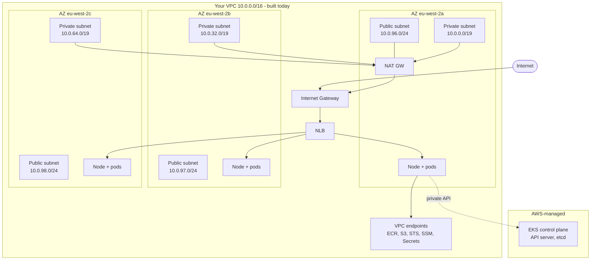
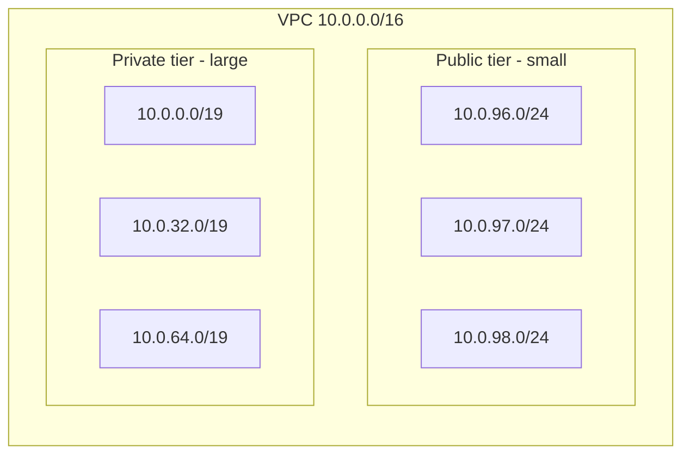
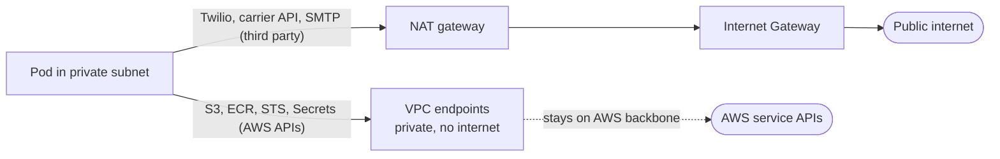

# Episode 3: VPC and network design

## Why this episode

You have nine images and a local stack that works. Before any of it runs on EKS, it needs somewhere to live. That somewhere is a VPC, and a VPC built for Kubernetes is not the same shape as the one your ECS project used.

This is the episode where most people copy their ECS VPC across, three public subnets and a NAT gateway, and then spend two later sessions confused about why their nodes have public IPs and why a `/24` ran out of addresses the moment Karpenter woke up. We design the network for EKS specifically and we make a deliberate, costed decision about the bit that quietly dominates the bill: egress.

No cluster yet. That is EP4. Today is the ground it stands on.

## What you walk out with

- A `terraform/modules/vpc` of your own, three AZs, public subnets for the load balancer and NAT, large private subnets for nodes and pods
- The subnet tags the AWS Load Balancer Controller needs, with a clear reason for each one
- A costed answer to the NAT question, with the VPC endpoints that make going light on NAT viable
- A mental model of which security group does what across the cluster, the nodes and the pods

Full brief: [project.md](../project.md). The relevant line is *"VPC with private subnets, no NAT if you can avoid it"*. By the end of this you will know exactly how far "if you can avoid it" stretches.

---

## The shape of the problem

> Editable architecture diagram for this session: [`diagrams/ep3-networking-architecture.drawio`](diagrams/ep3-networking-architecture.drawio) (three pages: the full VPC, the egress decision and the security-group layers). Open it in [draw.io](https://app.diagrams.net).

Here is roughly where everything ends up once the cluster is built on top of this VPC. We build the VPC, its subnets, routing and endpoints today. The nodes, NLB and control plane are drawn so you know what the network is for.



Three things to read off that picture before we build any of it:

- The **control plane is not in your VPC**. AWS runs it in an account you never see. It reaches into your VPC through elastic network interfaces placed in your private subnets, which is one reason those subnets carry the `internal-elb` tag. Your nodes talk to the API server over a private path.
- **Nodes sit in private subnets and have no public IP.** The only things in the public subnets are the NLB and the NAT gateway. If a node has a public IP, the network is wrong.
- **Two different things reach outside the VPC and they take different roads.** Inbound customer traffic comes through the Internet Gateway to the NLB. Outbound traffic from pods goes either through NAT (to the public internet) or through a VPC endpoint (to an AWS service). The whole NAT-versus-endpoints decision lives in that distinction.

---

## 1. Subnet layout

Two tiers, three AZs, six subnets.

| Tier | Per AZ | Holds | Public IP on launch |
|---|---|---|---|
| Public | `/24` (~250 IPs) | NLB, NAT gateway | yes |
| Private | `/19` (~8,000 IPs) | nodes, pods, control-plane ENIs | no |



### The tags are not decoration

The AWS Load Balancer Controller, which you install later, finds subnets by tag. It does not read your Terraform. It queries the AWS API for subnets carrying the right label.

- Public subnets get `kubernetes.io/role/elb = 1`. An internet-facing `Service` of type LoadBalancer or an Ingress lands its load balancer here.
- Private subnets get `kubernetes.io/role/internal-elb = 1`. Internal load balancers land here, and this is also where the control-plane ENIs go.
- Both tiers get `kubernetes.io/cluster/<cluster-name> = shared`, which tells the controller the subnet belongs to a cluster it manages. `shared` means more than one cluster may use it; `owned` means exactly one.

Forget the `elb` tag and your internet-facing Ingress sits in `pending` with an event message about no matching subnets. People lose an hour to this every cohort. The tags are in [`modules/vpc/main.tf`](terraform/modules/vpc/main.tf), read them.

### Why public subnets are tiny

A public subnet holds a NAT gateway and the occasional load balancer ENI. That is a handful of addresses per AZ. A `/24` is already generous. Burning a `/19` on a public subnet is wasted space you will want back later for a second cluster or a database tier.

---

## 2. The CIDR maths, and why a /16 fills up

This is the part that surprises people coming from ECS, and it is worth slowing down on, because the mistake here does not fail today. It surfaces three episodes later as a "random" cluster problem when Karpenter is mid-scale.

On EKS with the default **AWS VPC CNI**, every pod gets a real IP address from the **node's subnet**. There is no overlay network and no separate "pod CIDR" the way a kubeadm or Calico cluster has. Pod IPs and node IPs come out of the same pool. So a private subnet has to be sized for the nodes and for every pod those nodes will ever run at the same time.

### Where the per-node pod limit comes from

The default CNI does not give a node unlimited pod IPs. The ceiling is set by how many network interfaces the instance type supports and how many IPs each interface carries:

```
max pods = (ENIs per instance x (IPv4s per ENI - 1)) + 2
```

The `- 1` drops each ENI's primary IP, which the node keeps for itself. The `+ 2` covers host-network pods like `aws-node` and `kube-proxy` that ride the node IP and cost no secondary address. An `m5.large` is 3 ENIs at 10 IPs each, so `(3 x 9) + 2 = 29`. That is where the famous 29 comes from, and it is an ENI and IP ceiling rather than a CPU or memory one. A bigger instance buys more pods mostly because it carries more ENIs. AWS publishes the per-type number in `eni-max-pods.txt`, and the node's `.status.capacity.pods` shows the value it actually booted with.

### The warm pool, the bit that actually drains the subnet

Here is the nuance that catches people who did the napkin maths and still ran out. The CNI does not allocate one IP at a time. It attaches a whole ENI and keeps a spare ready so pod startup stays fast. The default `WARM_ENI_TARGET=1` means every node holds one full extra ENI's worth of IPs warm and idle. An `m5.large` running four pods can be sitting on roughly twenty subnet IPs, most of them doing nothing.

So your real subnet draw is closer to "nodes x IPs-per-ENI x warm factor" than "nodes x running pods". Two knobs tighten it when address space is precious:

- `WARM_IP_TARGET` with `MINIMUM_IP_TARGET` makes the CNI hold a small fixed pool of spare IPs instead of a whole ENI. Tighter packing, paid for with more EC2 API calls as pods churn, which can hit API throttling on a busy cluster.
- `WARM_ENI_TARGET=0` alongside a `MINIMUM_IP_TARGET` is the usual production setting for IP-constrained accounts.

Leave the defaults tonight. The thing to carry out of here is that the default trades address space for launch speed, and that the trade is tunable the day a subnet starts to fill.

### Size it on purpose

Do the sum once, up front, per AZ:

```
IPs per AZ  =  peak nodes in that AZ  x  max-pods per node  x  warm factor (~1.1 to 1.3)
```

Work the project. A `/19` private subnet is 8,192 addresses, AWS reserves 5, so call it 8,187 usable. Forty `m5.large` nodes at 29 pods is ~1,160 pod IPs, plus node and warm-pool IPs, sitting comfortably inside a `/19` with room to be careless. Drop to a `/24` at 251 usable and one busy node drains it, and the symptom is ugly: pods stuck in `ContainerCreating` while the CNI logs `failed to assign an IP address to container`. It reads like a cluster fault when the subnet has simply run dry. Size for the peak and leave headroom, because you cannot resize a subnet after the fact. You can only bolt on new ones.

### Prefix delegation, and the gotcha nobody mentions

Turning on prefix delegation changes the unit the CNI hands out. Each ENI gets a `/28` prefix of 16 IPs in one allocation instead of single addresses, which lifts pod density per node hard and is the right default for real workloads. Two things to know before you reach for it:

- AWS still caps `max-pods` at 110 on nodes under 30 vCPUs (250 above) by recommendation, so the win is density without the old ENI ceiling, rather than infinite pods on a node.
- A `/28` prefix has to be a **contiguous** block. On a long-lived, churny subnet the free space fragments, and the CNI can fail to find a free `/28` while hundreds of single IPs still sit free, throwing `InsufficientCidrBlocks`. The fix is to give prefix-delegation nodes subnets with generous contiguous space, which is one more argument for the large `/19`s.

### When a /16 genuinely is not enough

A VPC primary CIDR tops out at a `/16`, and a busy multi-cluster account works through `10.0.0.0/8` faster than people expect. Two real escape hatches, neither needed for this project:

- **Secondary CIDRs with custom networking.** Attach extra ranges to the VPC, including the carrier-grade `100.64.0.0/10` space, and point pod IPs at them through `ENIConfig` so pods stop competing with nodes for the routable range. More moving parts, used when RFC1918 space is genuinely tight.
- **IPv6 mode.** An IPv6 cluster hands every pod an address from a `/80` per ENI, which is effectively unlimited, and the exhaustion problem disappears. It is a cluster-creation-time decision with its own egress and tooling consequences, so it is a deliberate architecture call rather than a flag you flip later.

### The address ranges people confuse

Two different ranges live in an EKS cluster and people mix them up, which causes real outages:

- **VPC and subnet CIDR** (`10.0.0.0/16` here). Real and routable, and where nodes and pods both draw their IPs under the VPC CNI.
- **Service CIDR** (the cluster's `ClusterIP` range, EKS defaults to `10.100.0.0/16`, or `172.20.0.0/16` if that overlaps your VPC). Virtual and serviced by kube-proxy, it never leaves the node. It is fixed at cluster creation and cannot be changed afterwards, so it must not overlap the VPC or anything you peer with. Let it overlap and service traffic black-holes with no obvious error to point at.

There is deliberately no third "pod CIDR" here, which is worth saying out loud for anyone arriving from kubeadm or GKE. Under the VPC CNI the pod range *is* the subnet range, and that is the whole reason this section exists.

For the project, a `/16` VPC with three `/19` private subnets gives you room to be sloppy and still not run out. That is on purpose, so the network never becomes the thing you are debugging while you are still meeting everything else for the first time.

---

## 3. The NAT question

This is the decision that earns or loses you marks in the live review, because it is where cost and availability pull one way while keeping traffic private pulls another.

**What NAT is for.** A NAT gateway lets something in a private subnet start an outbound connection to the public internet. Pods need it to reach anything that is not inside your VPC: a third-party SMTP relay, Twilio, a carrier API, a public container registry that is not ECR.

**What it costs (London, eu-west-2).** A NAT gateway is about `$0.045` per hour, so roughly `$33` a month each, plus `$0.045` per GB of data processed. The two sane topologies:

| Topology | Monthly base | Survives an AZ outage | Notes |
|---|---|---|---|
| Single NAT | ~`$33` + data | no | cross-AZ data charges when other AZs route through it |
| One NAT per AZ | ~`$98` + data | yes | each AZ egresses locally, no cross-AZ hop |

### VPC endpoints, and the honest reckoning

The instinct is "endpoints are cheaper than NAT, so add a wall of them and drop NAT". That is half right and worth getting straight.

A VPC endpoint is a private door from your VPC straight to an AWS service, skipping the internet and the NAT hop. There are two kinds:

- **Gateway endpoints** (S3 and DynamoDB only). Free. You add a route, traffic to S3 stays on the AWS backbone. Always add the S3 one, because ECR stores image layers in S3 and that is the heaviest thing your nodes pull.
- **Interface endpoints** (everything else: ECR API, STS, SSM, Secrets Manager, CloudWatch Logs). These cost about `$0.01` per hour per AZ, so an endpoint across three AZs is roughly `$22` a month, plus `$0.01` per GB.

Now the maths people skip. Eight interface endpoints across three AZs is about `$175` a month. That is *more* than a single NAT gateway. So endpoints are not a blanket money-saver. Their real value is narrower and worth stating precisely:

- They cut NAT **data-processing** charges on high-volume AWS-bound paths, ECR pulls above all, which matters when Karpenter is constantly launching nodes that each pull images
- They keep AWS API traffic (STS for IRSA, Secrets Manager, SSM) off the public internet entirely, which is a security win you can defend independently of cost
- They let you go fully NAT-free, but only if nothing in your cluster needs the public internet

That last condition is where the project bites. `notification-service` wants a real SMTP or SMS provider and `shipping-service` calls carrier APIs. Both are third parties, neither has a VPC endpoint, so a truly NAT-free cluster cannot do its job. The defensible answer for this project is the pragmatic middle:

> One NAT gateway (dev) or one per AZ (prod), plus the S3 gateway endpoint and the ECR interface endpoints. NAT handles the genuine third-party egress. Endpoints take the heavy ECR and AWS-API traffic off NAT and keep it private.



The module exposes `nat_mode` as `none`, `single` or `per_az` precisely so you can make this call out loud and change it in one line. Dev runs `single`. When you write the README for your project, the sentence that gets you the mark is the one that explains why, not the one that says "I used a NAT gateway".

---

## 4. Security groups: cluster, node, pod

Three layers, and people muddle them. Keep them separate in your head.

- **Cluster security group.** EKS creates one automatically and attaches it to the control-plane ENIs and, by default, to managed nodes. It allows the control plane and nodes to talk to each other. You mostly leave it alone.
- **Node security group.** Attached to the EC2 instances. Controls traffic to and from the nodes themselves. This is where you would, for example, allow the NLB health checks in.
- **Pod security groups.** An opt-in feature (`SecurityGroupPolicy`, backed by the VPC CNI) that attaches an actual EC2 security group to an individual pod rather than to the whole node. Useful when one pod must reach an RDS instance that the rest of the node should not. Powerful and fiddly. You reach for it only when pod-level isolation genuinely matters.

The one in this episode's module is the **endpoints** security group: it allows HTTPS in from the VPC CIDR so pods can reach the interface endpoints, and nothing else. Small, single-purpose, easy to defend. See it in [`modules/vpc/main.tf`](terraform/modules/vpc/main.tf).

---

## Deep dive: build it, then break it

The reference Terraform is in [`terraform/`](terraform). Module in `modules/vpc`, a dev root in `envs/dev`. Read every resource before you run it. Treat it as reference rather than a thing to lift, because the live review asks you to explain each line.

```bash
cd 03-networking/terraform/envs/dev
cp terraform.tfvars.example terraform.tfvars   # edit if you like

terraform init
terraform plan      # read it. count the resources. find the two route-table tiers
```

What to look for in the plan before you apply:

- Six subnets, three public and three private, each in a different AZ
- One NAT gateway and one EIP (because `nat_mode = single`), not three
- One S3 gateway endpoint and a set of interface endpoints, each with the endpoints security group
- Public subnets tagged `kubernetes.io/role/elb`, private tagged `internal-elb`

If you have an account to spend in:

```bash
terraform apply

# prove the subnets are tagged the way the LB controller expects
aws ec2 describe-subnets \
  --filters "Name=vpc-id,Values=$(terraform output -raw vpc_id)" \
  --query 'Subnets[].{AZ:AvailabilityZone,CIDR:CidrBlock,Tags:Tags[?contains(Key,`role`)]}' \
  --output table
```

### Now break it on purpose

Flip the egress model and watch the plan change. This is the cheapest way to feel the cost lever before you commit to it.

```bash
# set nat_mode = "per_az" in terraform.tfvars
terraform plan
# three NAT gateways, three EIPs, each private route table now points at its own NAT.
# that is the +$65/month line item. you just saw HA cost what it costs.

# set nat_mode = "none"
terraform plan
# zero NAT, the private 0.0.0.0/0 routes vanish. pods can reach S3 and ECR via endpoints
# but notification-service can no longer reach an external SMTP relay. that is the trade.
```

Put `nat_mode` back to `single` and `terraform apply` when you are done, or `terraform destroy`. A NAT gateway bills by the hour whether traffic flows or not, so do not leave one running overnight for no reason.

---

## Pitfalls

- **Carrying the ECS VPC across.** Three public subnets and nothing private. EKS nodes do not belong in public subnets. Start from the two-tier layout rather than from what worked for ECS.
- **Sizing private subnets for nodes.** They hold pods too, and under the default CNI every pod is a VPC IP. Size for the pod count.
- **Forgetting the warm pool when you size.** A node holds a whole spare ENI of IPs by default, so a subnet drains faster than running-pod count suggests. Size with a warm factor, or tune `WARM_IP_TARGET` when space is tight.
- **Overlapping the service CIDR.** The `ClusterIP` range is fixed at cluster creation and must not overlap the VPC or a peered network. Let it overlap and service traffic black-holes with no obvious error to point at.
- **Missing the subnet tags.** No `elb` tag means an internet-facing Ingress that never gets a load balancer. No `cluster` tag means the controller ignores the subnet entirely.
- **Treating endpoints as free money.** A wall of interface endpoints can cost more than the NAT you were trying to avoid. Add the free S3 gateway endpoint and the ECR ones with intent, then measure before adding the rest.
- **One NAT and calling it highly available.** A single NAT is a single AZ. If that AZ goes, every other AZ loses egress. Fine for dev, name the risk for prod.
- **Wrapping `terraform-aws-modules/vpc`.** The rubric says your own module. Wrapping the upstream one does not count. Borrow ideas from it, write your own resources.

---

## Homework

1. Build the VPC in your project repo with your own module. Do not copy this one file for file, type it out and make the structure yours
2. `terraform plan` with `nat_mode` set to each of `single`, `per_az` and `none` in turn. Write down the resource-count difference and the rough monthly cost difference for each
3. Apply with `single`, then run the `describe-subnets` command above and confirm every subnet carries the tag tier you expect
4. Write the paragraph for your project README that answers the NAT question for *your* design. State the topology, the cost and why it fits the workload. This is the artefact the live review grades
5. Read the [AWS VPC CNI docs on IP address management](https://docs.aws.amazon.com/eks/latest/userguide/managing-vpc-cni.html) far enough to explain prefix delegation in one sentence

Bring the cost numbers to the next session. EP4 puts a cluster in this VPC.

---

## Appendix A: CoderCo's Technical Vocab (CTV) Dictionary

Networking edition. Skip what you know.

### VPC and subnets

- **VPC (Virtual Private Cloud)**: your own isolated network inside an AWS region. Everything in this project lives in one
- **CIDR block**: a range of IP addresses written as `10.0.0.0/16`. The number after the slash is how many bits are fixed; smaller number means more addresses. A `/16` is ~65k, a `/24` is ~250
- **Subnet**: a slice of the VPC CIDR pinned to one Availability Zone. Resources live in subnets, not in the VPC directly
- **Availability Zone (AZ)**: a physically separate datacentre within a region. Three AZs means an outage in one does not take the cluster down
- **Public subnet**: a subnet whose route table sends `0.0.0.0/0` to an Internet Gateway. Things here can have public IPs
- **Private subnet**: a subnet with no route to the Internet Gateway. Outbound internet, if any, goes via NAT. Nodes and pods live here

### Routing and egress

- **Internet Gateway (IGW)**: the VPC's door to the public internet. One per VPC. Inbound and outbound both pass through it
- **Route table**: a list of "traffic for this CIDR goes to this target". Each subnet is associated with exactly one
- **NAT Gateway**: lets private resources start outbound connections to the internet without being reachable from it. Bills per hour and per GB processed
- **EIP (Elastic IP)**: a static public IP. A NAT gateway needs one
- **Egress**: outbound traffic leaving a resource. The whole NAT-versus-endpoints decision is about egress
- **VPC Endpoint**: a private route from your VPC to an AWS service, skipping the internet. Gateway type (S3, DynamoDB) is free; Interface type (everything else) costs per hour per AZ
- **PrivateLink**: the technology behind interface endpoints. The AWS service appears as an ENI inside your subnet

### Kubernetes networking on AWS

- **AWS VPC CNI**: the default EKS pod-networking plugin. Gives every pod a real VPC IP from the node's subnet. This is why subnet sizing matters so much
- **Prefix delegation**: a VPC CNI mode that assigns each ENI a `/28` block of 16 IPs at once, raising how many pods a node can run and slowing how fast a subnet drains
- **ENI (Elastic Network Interface)**: a virtual network card. Nodes attach several; the CNI hands their IPs to pods. The control plane also places ENIs in your private subnets
- **NLB (Network Load Balancer)**: a layer-4 (TCP) load balancer. Sits in public subnets and fronts the Ingress controller
- **AWS Load Balancer Controller**: the in-cluster controller that turns a Kubernetes Ingress or LoadBalancer Service into a real AWS load balancer. Finds subnets by tag
- **Subnet discovery tags**: `kubernetes.io/role/elb`, `kubernetes.io/role/internal-elb` and `kubernetes.io/cluster/<name>`. How the controller decides where to put load balancers

### Security

- **Security group**: a stateful virtual firewall attached to an ENI. Allow rules only; anything not allowed is denied
- **Cluster security group**: the one EKS creates for control-plane-to-node traffic
- **Node security group**: attached to the EC2 worker instances
- **Pod security group**: an opt-in feature attaching a security group to individual pods via a `SecurityGroupPolicy`, for pod-level isolation
- **Stateful firewall**: one that remembers outbound connections and automatically allows the return traffic, so you do not write a matching inbound rule for every reply

---

See you in episode 4, where the cluster goes in.
