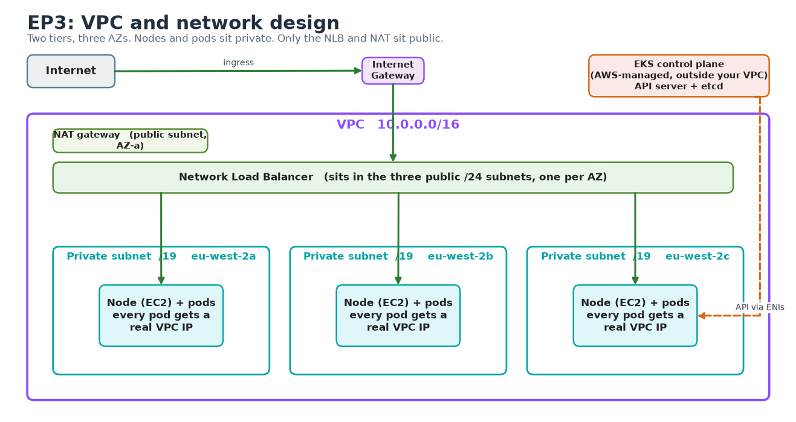
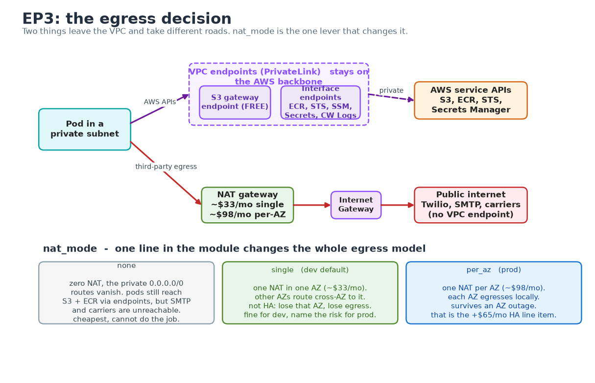
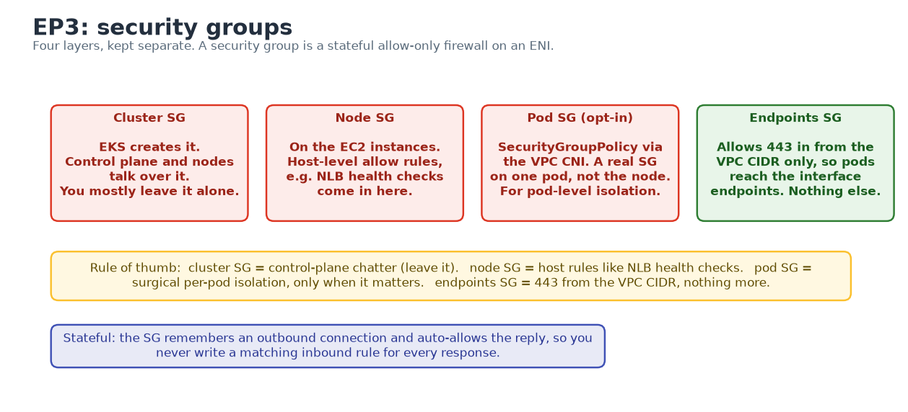

# Episode 3: VPC and network design

## Why this episode

You can already build a VPC. Subnets, route tables, an IGW, a NAT gateway, you have wired all of that before. This episode is about the parts that are specific to EKS and the parts that only bite once the platform grows, because a VPC built for Kubernetes is not the shape of the one your ECS project used.

No cluster yet. That is EP4. Today is the ground it stands on.

## What you walk out with

- A `terraform/modules/vpc` of your own: three AZs, small public subnets for the load balancer and NAT, large private subnets for nodes and pods
- The subnet tags the AWS Load Balancer Controller and Karpenter need, with a clear reason for each
- A costed answer to the NAT question, with the VPC endpoints that make going light on NAT viable
- A feel for what bites at scale: IP exhaustion, cross-AZ data cost, the DNS packet ceiling and NAT port exhaustion
- A mental model of which security group does what across the cluster, the nodes and the pods

---

## The problem

> Editable diagram for this session: [`diagrams/ep3-networking-architecture.drawio`](diagrams/ep3-networking-architecture.drawio) (three pages: the VPC, the egress decision and the security-group layers). Open it in [draw.io](https://app.diagrams.net). The PNGs below are exports of it.



Three things to read off that picture before we build any of it:

- The **control plane is not in your VPC**. AWS runs it in an account you never see. It reaches into your VPC through ENIs placed in your private subnets, which is one reason those subnets carry the `internal-elb` tag. Your nodes talk to the API server over a private path.
- **Nodes sit in private subnets and have no public IP.** The only things in the public subnets are the NLB and the NAT gateway. If a node has a public IP, the network is wrong.
- **Two different things reach outside the VPC and they take different roads.** Inbound customer traffic comes through the IGW to the NLB. Outbound traffic from pods goes either through NAT (to the public internet) or through a VPC endpoint (to an AWS service). The whole NAT-versus-endpoints decision lives in that distinction.

---

## 1. Subnet layout

Two tiers, three AZs, six subnets. You know the shape, the EKS-specific parts are the sizing and the tags.

| Tier | Per AZ | Holds | Public IP on launch |
|---|---|---|---|
| Public | `/24` (~250 IPs) | NLB, NAT gateway | yes |
| Private | `/19` (~8,000 IPs) | nodes, pods, control-plane ENIs | no |

The public tier is deliberately tiny: it holds a NAT gateway and the occasional load-balancer ENI, so a `/24` is already generous. The private tier is large for a reason that catches everyone, covered in section 2.

### The tags are important

Two different controllers find subnets by querying the AWS API for tags. Neither reads your Terraform. Get the tags wrong and the symptom shows up far from the cause.

- Public subnets get `kubernetes.io/role/elb = 1`. An internet-facing `Service` of type LoadBalancer or an Ingress lands its load balancer here.
- Private subnets get `kubernetes.io/role/internal-elb = 1`. Internal load balancers land here, and so do the control-plane ENIs.
- Both tiers get `kubernetes.io/cluster/<cluster-name> = shared`. `shared` means more than one cluster may use the subnet, `owned` means exactly one.
- Karpenter finds the subnets it launches nodes into by its own tag (commonly `karpenter.sh/discovery = <cluster>`) referenced from the `EC2NodeClass`. Tag only the subnets you want it spreading nodes across, otherwise it will happily launch where you did not expect.

Forget the `elb` tag and your internet-facing Ingress sits in `pending` with a no-matching-subnets event. People lose an hour to this every cohort. The tags are in [`modules/vpc/main.tf`](terraform/modules/vpc/main.tf), read them.

---

## 2. IP planning, and why a /16 fills up

This is the part that surprises people coming from ECS, and it is worth slowing down on, because the mistake does not fail today. It surfaces three episodes later as a "random" cluster problem when Karpenter is mid-scale.

On EKS with the default **AWS VPC CNI**, every pod gets a real IP from the **node's subnet**. There is no overlay and no separate "pod CIDR" the way a kubeadm or Calico cluster has. Pod IPs and node IPs come out of the same pool, so a private subnet has to be sized for the nodes and for every pod those nodes will ever run at the same time.

### Where the per-node pod limit comes from

The default CNI does not give a node unlimited pod IPs. The ceiling is set by how many ENIs the instance type supports and how many IPs each ENI carries:

```
max pods = (ENIs per instance x (IPv4s per ENI - 1)) + 2
```

The `- 1` drops each ENI's primary IP, which the node keeps. The `+ 2` covers host-network pods like `aws-node` and `kube-proxy` that ride the node IP and cost no secondary address. An `m5.large` is 3 ENIs at 10 IPs each, so `(3 x 9) + 2 = 29`. That is where the famous 29 comes from, and it is an ENI and IP ceiling rather than a CPU one. A bigger instance buys more pods mostly because it carries more ENIs. AWS publishes the per-type number in `eni-max-pods.txt`, and the node's `.status.capacity.pods` shows what it booted with.

### The warm pool, the bit that actually drains the subnet

Here is the nuance that catches people who did the napkin maths and still ran out. The CNI does not allocate one IP at a time. It attaches a whole ENI and keeps a spare ready so pod startup stays fast. The default `WARM_ENI_TARGET=1` means every node holds one full extra ENI's worth of IPs warm and idle. An `m5.large` running four pods can be sitting on roughly twenty subnet IPs, most of them doing nothing.

So your real subnet draw is closer to "nodes x IPs-per-ENI x warm factor" than "nodes x running pods". Two knobs tighten it when address space is precious:

- `WARM_IP_TARGET` with `MINIMUM_IP_TARGET` makes the CNI hold a small fixed pool of spare IPs instead of a whole ENI. Tighter packing, paid for with more EC2 API calls as pods churn, which can hit API throttling on a busy cluster.
- `WARM_ENI_TARGET=0` alongside a `MINIMUM_IP_TARGET` is the usual production setting for IP-constrained accounts.

Leave the defaults tonight. Carry away that the default trades address space for launch speed, and the trade is tunable the day a subnet starts to fill.

### Size it on purpose

Do the sum once, up front, per AZ:

```
IPs per AZ  =  peak nodes in that AZ  x  max-pods per node  x  warm factor (~1.1 to 1.3)
```

Work the project. A `/19` private subnet is 8,192 addresses, AWS reserves 5, so call it 8,187 usable. Forty `m5.large` nodes at 29 pods is ~1,160 pod IPs, plus node and warm-pool IPs, sitting comfortably inside a `/19` with room to be careless. Drop to a `/24` at 251 usable and one busy node drains it, and the symptom is ugly: pods stuck in `ContainerCreating` while the CNI logs `failed to assign an IP address to container`. It reads like a cluster fault when the subnet has simply run dry. Size for the peak and leave headroom, because you cannot resize a subnet after the fact. You can only bolt on new ones.

### Prefix delegation, and the gotcha nobody mentions

Turning on prefix delegation changes the unit the CNI hands out. Each ENI gets a `/28` prefix of 16 IPs in one allocation instead of single addresses, which lifts pod density per node hard and is the right default for real workloads. Two things to know before you reach for it:

- AWS still caps `max-pods` at 110 on nodes under 30 vCPUs (250 above) by recommendation, so the win is density without the old ENI ceiling, rather than infinite pods on a node.
- A `/28` prefix has to be a **contiguous** block. On a long-lived, churny subnet the free space fragments, and the CNI can fail to find a free `/28` while hundreds of single IPs still sit free, throwing `InsufficientCidrBlocks`. The fix is to give prefix-delegation nodes subnets with generous contiguous space, one more argument for the large `/19`s.

### When a /16 genuinely is not enough

A VPC primary CIDR tops out at a `/16`, and a busy multi-cluster account works through `10.0.0.0/8` faster than people expect. Two real escape hatches, neither needed for this project:

- **Secondary CIDRs with custom networking.** Attach extra ranges to the VPC, including the carrier-grade `100.64.0.0/10` space, and point pod IPs at them through `ENIConfig` so pods stop competing with nodes for the routable range. More moving parts, used when RFC1918 space is genuinely tight.
- **IPv6 mode.** An IPv6 cluster hands every pod an address from a `/80` per ENI, effectively unlimited, and the exhaustion problem disappears. It is a cluster-creation-time decision with its own egress and tooling consequences, so it is a deliberate architecture call rather than a flag you flip later.

### The address ranges people confuse

Two ranges live in an EKS cluster and people mix them up, which causes real outages:

- **VPC and subnet CIDR** (`10.0.0.0/16` here). Real and routable, where nodes and pods both draw their IPs under the VPC CNI.
- **Service CIDR** (the cluster's `ClusterIP` range, EKS defaults to `10.100.0.0/16`, or `172.20.0.0/16` if that overlaps your VPC). Virtual and serviced by kube-proxy, it never leaves the node. It is fixed at cluster creation and cannot be changed afterwards, so it must not overlap the VPC or anything you peer with. Let it overlap and service traffic black-holes with no obvious error to point at.

Under the VPC CNI there is deliberately no third "pod CIDR", the pod range *is* the subnet range. That is the whole reason this section exists.

---

## 3. The NAT question

This is the decision that earns or loses you marks in the live review, because cost and availability pull one way while keeping traffic private pulls another.

**What NAT is for.** A NAT gateway lets something in a private subnet start an outbound connection to the public internet: a third-party SMTP relay, Twilio, a carrier API, a public registry that is not ECR.

**What it costs (London, eu-west-2).** A NAT gateway is about `$0.045` per hour, so roughly `$33` a month each, plus `$0.045` per GB processed. The two sane topologies:

| Topology | Monthly base | Survives an AZ outage | Notes |
|---|---|---|---|
| Single NAT | ~`$33` + data | no | other AZs pay cross-AZ data charges routing to it |
| One NAT per AZ | ~`$98` + data | yes | each AZ egresses locally, no cross-AZ hop |



### VPC endpoints, and the honest reckoning

The instinct is "endpoints are cheaper than NAT, so add a wall of them and drop NAT". That is half right and worth getting straight. A VPC endpoint is a private door from your VPC straight to an AWS service, skipping the internet and the NAT hop. Two kinds:

- **Gateway endpoints** (S3 and DynamoDB only). Free. Add a route and traffic to S3 stays on the AWS backbone. Always add the S3 one, because ECR stores image layers in S3 and that is the heaviest thing your nodes pull.
- **Interface endpoints** (everything else: ECR API, STS, SSM, Secrets Manager, CloudWatch Logs). About `$0.01` per hour per AZ, so roughly `$22` a month across three AZs, plus `$0.01` per GB.

Now the maths people skip. Eight interface endpoints across three AZs is about `$175` a month, *more* than a single NAT gateway. So endpoints are not a blanket money-saver. Their real value is narrower:

- They cut NAT **data-processing** charges on high-volume AWS-bound paths, ECR pulls above all, which matters when Karpenter is constantly launching nodes that each pull images
- They keep AWS API traffic (STS for IRSA, Secrets Manager, SSM) off the public internet entirely, a security win you can defend independently of cost
- They let you go fully NAT-free, but only if nothing in your cluster needs the public internet

That last condition is where the project bites. `notification-service` wants a real SMTP or SMS provider and `shipping-service` calls carrier APIs. Both are third parties with no VPC endpoint, so a truly NAT-free cluster cannot do its job. The defensible answer is the pragmatic middle:

> One NAT gateway (dev) or one per AZ (prod), plus the S3 gateway endpoint and the ECR interface endpoints. NAT handles the genuine third-party egress. Endpoints take the heavy ECR and AWS-API traffic off NAT and keep it private.

The module exposes `nat_mode` as `none`, `single` or `per_az` so you can make this call out loud and change it in one line. Dev runs `single`. The sentence that gets you the mark is the one that explains why this fits the workload, not the one that says "I used a NAT gateway".

---

## 4. Security groups: cluster, node, pod

Four layers, and people muddle them. Keep them separate in your head.



- **Cluster security group.** EKS creates it and attaches it to the control-plane ENIs and, by default, to managed nodes. It carries control-plane to node traffic. You mostly leave it alone.
- **Node security group.** On the EC2 instances. Controls traffic to and from the nodes, this is where you allow NLB health checks in.
- **Pod security groups.** Opt-in (`SecurityGroupPolicy`, backed by the VPC CNI), attaching a real EC2 security group to one pod rather than the whole node. Useful when a single pod must reach something the rest of the node should not. Powerful and fiddly, reach for it only when pod-level isolation genuinely matters.
- **Endpoints security group** (the one in this module). Allows HTTPS in from the VPC CIDR so pods reach the interface endpoints, and nothing else. Small, single-purpose, easy to defend.

The SG is stateful: it remembers an outbound connection and auto-allows the reply, so you never write a matching inbound rule for every response. See it in [`modules/vpc/main.tf`](terraform/modules/vpc/main.tf).

---

## 5. VPC at scale: what bites in the real world

None of this shows up in a four-node dev cluster. All of it shows up when the platform grows, and it is the difference between someone who has built one VPC and someone who has run one. Read it now so you recognise the symptom later.

### Cross-AZ data transfer is a real line on the bill

Every GB that crosses an AZ boundary costs about `$0.01` each way. With three AZs and chatty services, a lot crosses: every pod-to-pod call that lands in another AZ, plus a single NAT where the other two AZs pay a cross-AZ hop on top of NAT processing. Add Postgres replicas streaming to a standby in another AZ and it compounds. At a few TB a day this becomes one of the larger lines on the bill, and it stays invisible until you read Cost Explorer by usage type. At scale you pull traffic back in-AZ with topology-aware routing (`trafficDistribution: PreferClose` on Services) and you stop pretending a single NAT is free.

### DNS is usually the first scaling wall

CoreDNS forwards anything it cannot answer to the VPC resolver at the `.2` address, and that resolver is capped at roughly **1024 packets per second per ENI**. A busy cluster with the default `ndots: 5` does up to five lookups for every external name (it tries the search domains first), so real query volume is a multiple of what you would guess. Hit the ceiling and you get intermittent five-second DNS timeouts that look like the whole platform is flaking, with nothing obviously wrong. The fixes are NodeLocal DNSCache (a per-node resolver that collapses the fan-out), enough CoreDNS replicas, and lowering `ndots` or using fully-qualified names for hot lookups.

### NAT SNAT port exhaustion

A NAT gateway gives about **55,000 simultaneous connections per unique destination**. A fleet that hammers one external endpoint, a payment provider or an S3 prefix you forgot to route through the gateway endpoint, can exhaust SNAT ports and new connections start failing with timeouts while bandwidth sits idle. Endpoints take AWS-bound load off NAT entirely. For third parties, the levers are connection reuse, spreading destinations and adding NAT capacity.

### Plan the address space before you ever peer

A standalone VPC can use any range. The day you peer it, attach it to a Transit Gateway or connect a second cluster, overlapping CIDRs become a wall you cannot route around, because routing cannot disambiguate two identical ranges. Pick non-overlapping ranges from an IPAM plan now, even for dev. From the trenches: a fintech I worked on had prod and QA VPCs both sitting on `10.0.0.0/16`, and once they needed cross-environment traffic the only fix was per-`/32` static routes bolted on by hand, audited across every route table. The rule: allocate ranges centrally before the first VPC ships, never per-team on a whim.

### A few more that only matter once you are big

- **EC2 API throttling.** Tightening `WARM_IP_TARGET` to save IPs trades into more EC2 API calls, and across a large fleet that hits account-level throttling and slows pod startup. Pick the trade deliberately.
- **Security group limits.** Default 60 rules per SG and a handful of SGs per ENI. Pod-level SGs consume branch ENIs with their own caps. At scale, prefer a few CIDR-based rules over a sprawl of per-app groups.
- **Endpoint cost creep.** Interface endpoints bill per AZ per hour whether traffic flows or not, so a wall added "just in case" is pure waste. Add them by measured need, not by reflex.
- **Subnet reservation.** Leave room in the VPC for a second node subnet per AZ, a database tier and an endpoints subnet. You cannot grow a subnet later, so the space you do not carve up today is the space you keep.

---

## Deep dive: build it, then break it

The reference Terraform is in [`terraform/`](terraform). Module in `modules/vpc`, a dev root in `envs/dev`. Read every resource before you run it. Treat it as reference rather than a thing to lift, because the live review asks you to explain each line.

```bash
cd 03-networking/terraform/envs/dev
cp terraform.tfvars.example terraform.tfvars   # edit if you like

terraform init
terraform plan      # read it. count the resources. find the two route-table tiers
```

What to look for in the plan before you apply:

- Six subnets, three public and three private, each in a different AZ
- One NAT gateway and one EIP (because `nat_mode = single`), not three
- One S3 gateway endpoint and a set of interface endpoints, each with the endpoints security group
- Public subnets tagged `kubernetes.io/role/elb`, private tagged `internal-elb`

If you have an account to spend in:

```bash
terraform apply

# prove the subnets are tagged the way the LB controller expects
aws ec2 describe-subnets \
  --filters "Name=vpc-id,Values=$(terraform output -raw vpc_id)" \
  --query 'Subnets[].{AZ:AvailabilityZone,CIDR:CidrBlock,Tags:Tags[?contains(Key,`role`)]}' \
  --output table
```

### Now break it on purpose

Flip the egress model and watch the plan change. This is the cheapest way to feel the cost lever before you commit to it.

```bash
# set nat_mode = "per_az" in terraform.tfvars
terraform plan
# three NAT gateways, three EIPs, each private route table now points at its own NAT.
# that is the +$65/month line item. you just saw HA cost what it costs.

# set nat_mode = "none"
terraform plan
# zero NAT, the private 0.0.0.0/0 routes vanish. pods can reach S3 and ECR via endpoints
# but notification-service can no longer reach an external SMTP relay. that is the trade.
```

Put `nat_mode` back to `single` and `terraform apply` when you are done, or `terraform destroy`. A NAT gateway bills by the hour whether traffic flows or not, so do not leave one running overnight for no reason.

---

## Pitfalls

- **Carrying the ECS VPC across.** Three public subnets and nothing private. EKS nodes do not belong in public subnets. Start from the two-tier layout.
- **Sizing private subnets for nodes.** They hold pods too, and under the default CNI every pod is a VPC IP. Size for the pod count.
- **Forgetting the warm pool when you size.** A node holds a whole spare ENI of IPs by default, so a subnet drains faster than running-pod count suggests. Size with a warm factor, or tune `WARM_IP_TARGET` when space is tight.
- **Overlapping CIDRs you will later need to route.** The service CIDR must not overlap the VPC, and two VPCs you will peer must not overlap each other. Both black-hole traffic with no obvious error. Plan ranges before the first VPC ships.
- **Treating a single NAT as free.** Beyond the AZ-failure risk, every other AZ pays a cross-AZ data hop to reach it. Fine for dev, cost it for prod.
- **Missing the subnet tags.** No `elb` tag means an Ingress that never gets a load balancer. No `cluster` or `karpenter.sh/discovery` tag means the controller or Karpenter ignores the subnet.
- **Treating endpoints as free money.** A wall of interface endpoints can cost more than the NAT you were avoiding. Add the S3 gateway endpoint and the ECR ones with intent, then measure before adding the rest.
- **Wrapping `terraform-aws-modules/vpc`.** The rubric says your own module. Wrapping the upstream one does not count. Borrow ideas, write your own resources.

---

## Homework

1. Build the VPC in your project repo with your own module. Do not copy this one file for file, type it out and make the structure yours
2. `terraform plan` with `nat_mode` set to each of `single`, `per_az` and `none` in turn. Write down the resource-count difference and the rough monthly cost difference for each
3. Apply with `single`, then run the `describe-subnets` command above and confirm every subnet carries the tag tier you expect
4. Write the paragraph for your project README that answers the NAT question for *your* design. State the topology, the cost and why it fits the workload. This is the artefact the live review grades
5. Size your private subnets properly: pick a peak node count, work the per-AZ IP sum from section 2 and write down the `/19` (or whatever you land on) with the maths next to it

Bring the cost numbers and your sizing maths to the next session. EP4 puts a cluster in this VPC.

---

## Appendix A: CoderCo's Technical Vocab (CTV) Dictionary

Networking edition, the EKS-specific terms only. Skip what you know.

- **AWS VPC CNI**: the default EKS pod-networking plugin. Gives every pod a real VPC IP from the node's subnet, which is why subnet sizing matters so much
- **ENI (Elastic Network Interface)**: a virtual network card. Nodes attach several, the CNI hands their IPs to pods, and the control plane also places ENIs in your private subnets
- **Warm pool**: the spare IPs and ENIs the CNI keeps attached and idle for fast pod startup, tuned with `WARM_ENI_TARGET` / `WARM_IP_TARGET`
- **Prefix delegation**: a CNI mode that assigns each ENI a `/28` block of 16 IPs at once, raising pod density and slowing how fast a subnet drains
- **Custom networking**: pointing pod IPs at a secondary VPC CIDR (often `100.64.0.0/10`) via `ENIConfig`, used when RFC1918 space is tight
- **Service CIDR**: the cluster's virtual `ClusterIP` range, fixed at creation, serviced by kube-proxy, must not overlap the VPC
- **VPC endpoint**: a private route from your VPC to an AWS service. Gateway type (S3, DynamoDB) is free, interface type (PrivateLink) costs per hour per AZ
- **Subnet discovery tags**: `kubernetes.io/role/elb`, `kubernetes.io/role/internal-elb`, `kubernetes.io/cluster/<name>` and `karpenter.sh/discovery`. How the LB controller and Karpenter decide where to act
- **NodeLocal DNSCache**: a per-node DNS cache that collapses CoreDNS fan-out and keeps you under the VPC resolver's per-ENI packet ceiling
- **Pod security group**: an opt-in `SecurityGroupPolicy` attaching a real SG to individual pods for pod-level isolation

---

See you in episode 4, where the cluster goes in.
