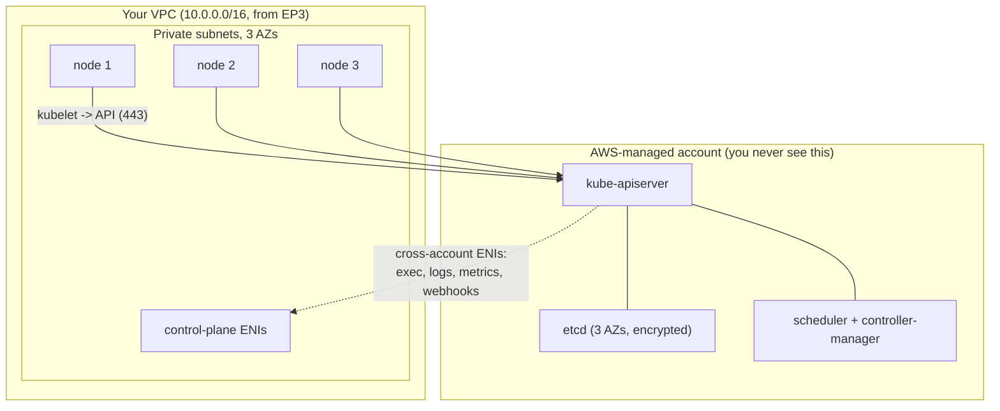

# Episode 4: The EKS cluster

## Today

Last week we went through the VPC. Three AZs, private subnets sized for the CNI, a NAT. 

This week we create a K8s control plane on top of it and put a handful of nodes in those private subnets, so that by the end you can run `kubectl get nodes` against a real cluster using your own IAM identity.

This is the episode that covers the two lines from the project brief:

> EKS 1.33 or above across 3 AZs with managed node groups

> Terraform with remote state

The cluster is the foundation everything else bolts onto: Karpenter, the storage layer, Traefik, ArgoCD. Get the IAM and the access model wrong here and you wont even get to access your cluster. Get it right and you barely need to think about it. 

One thing for tonight, straight from the EKS rubric:

> Reaching for the community module `terraform-aws-modules/eks` is the trap (unless you want to skip the learning and fun of building your own module). I would recommend write your own module. 

##O Outcome

- A clear understanding of what AWS runs for you (the control plane) and what you run yourself (the data plane).

- Your own `modules/eks`, no upstream module anywhere in the tree.

- A cluster on a current Kubernetes version across three AZs, control plane logging on, the four core addons installed.

- A small managed node group as the bootstrap data plane, sized to host the system pods and nothing more.

- `kubectl` access through your own IAM identity using access entries, plus the scar tissue from locking yourself out and fixing it through Terraform.

## Prerequisites

You should be able to do this from last week:

```bash
cd 03-networking/terraform/envs/dev
terraform output private_subnet_ids   # three subnet ids, one per AZ
```

If that prints three ids you are ready. EP4 consumes those subnets.

Tools, with the install one-liners:

```bash
aws --version        # v2, configured: brew install awscli
terraform -version   # >= 1.10 (native S3 state locking): brew install terraform
kubectl version --client  # >= 1.33 for a 1.34 server: brew install kubectl
```

One thing to check before we start: run `aws sts get-caller-identity` and read the `Arn` it prints. That ARN is you. Write it down, you grant it cluster access later in the session and it is the single most common thing people get wrong.

## The problem

EKS splits the cluster down the middle. AWS owns one half, you own the other. Nearly every confusing thing about EKS comes from not knowing which half you are looking at.



Read three things off this before we build:

- **The control plane is not in your VPC.** It runs in an AWS-owned account you have no access to. You reach it over an HTTPS endpoint, nothing else.

- **The control plane still reaches into your VPC.** EKS drops a few elastic network interfaces (ENIs) into your private subnets so the API server can do things like `kubectl exec` and admission webhooks. That is why the cluster needs your subnet ids and why those subnets need spare IPs.

- **Your nodes open the connection to the control plane.** The kubelet on each node dials the API server endpoint on 443. So nodes need a route to that endpoint, public or private. For routine work the traffic flows node to API, the reach-in ENIs are only for things like exec and logs.

> Editable diagram: [`diagrams/ep4-cluster-architecture.drawio`](diagrams/ep4-cluster-architecture.drawio). Three pages: the control-plane / data-plane split, the three IAM roles and the access-entry flow.

## 1. Control plane vs data plane

**What the control plane is.** The brain of Kubernetes: the API server every command talks to, etcd that stores the entire cluster state, the scheduler that decides which node a pod lands on and the controllers that drive the cluster towards the state you declared. On EKS, AWS runs all of it. It is spread across three AZs, etcd is encrypted and patching is handled for you. You cannot SSH it and you cannot see the etcd. You get an endpoint and an API.

**What the data plane is.** The nodes, which are plain EC2 instances running the kubelet and a container runtime, plus the pods on them. This half is yours. You choose the instance types, you patch the AMIs (or let a managed node group do it), you decide how many there are. Karpenter and managed node groups both live on this side.

**What it costs.** The control plane is a flat fee: `$0.10` per hour, about `$73` a month per cluster, on standard support. That fee buys you a highly available, three-AZ control plane you do not have to operate. The nodes are billed as normal EC2 on top.

**Picking a version is a cost decision.** EKS gives each Kubernetes minor version 14 months of standard support, then 12 months of extended support at `$0.60` an hour, six times the price. The newest version right now is 1.36. The project floor is 1.33, but 1.33 reaches the end of standard support around mid-2026, so a cluster you stand up today on 1.33 is about to start billing at the extended rate. Default to a current standard-support version (this module ships 1.34) and check the AWS support calendar before you pin one. One rule from this: a cluster that is not updated will increase the bills. Known as version currency.

> **What is an ENI?** An elastic network interface is a virtual NIC with its own private IP, attached to something inside a subnet. EKS uses them in two places. The control plane drops a few into your subnets to reach in. The VPC CNI hands one IP per ENI to your pods, which is the EP3 max-pods maths.

**Endpoint access.** The cluster API endpoint can be public, private or both. Public means reachable from the internet (locked to CIDRs you choose). Private means only reachable from inside the VPC. For a dev cluster you are driving from your laptop, public-and-private with the public side locked to your office or home IP is the pragmatic choice. Wide-open `0.0.0.0/0` is the lazy choice and it is a Pitfall below.

## 2. The bootstrap node group

You will use Karpenter for node autoscaling later. Today you just need a small fixed node group instead.

**The chicken and egg.** Karpenter is itself a workload. It runs as a Deployment inside the cluster, watches for unschedulable pods and calls the EC2 API to bring up nodes. Read that again: Karpenter needs a node to run on before it can create any nodes. A brand new cluster with zero nodes and only Karpenter has nowhere to place the Karpenter pod, so nothing ever starts. CoreDNS has the same problem, it is a Deployment that needs somewhere to schedule.

So you bootstrap with a managed node group. A managed node group is an EKS-managed Auto Scaling group: EKS owns the launch template, the AL2023 EKS-optimised AMI, the join process and the rolling upgrades. You give it a size and three subnets, it gives you nodes that are already registered with the cluster.

**Size it small on purpose.** This group exists to host system pods: CoreDNS, the CNI and EBS CSI controllers, kube-proxy, then Karpenter and later ArgoCD. It does not run your nine services, Karpenter will bring up nodes for those. So:

| Setting | Value | Why |
|---|---|---|
| Instance type | `t3.large` | 2 vCPU, 8 GiB. Headroom for the system pods plus Karpenter and ArgoCD later |
| Capacity type | `ON_DEMAND` | System plumbing should not get interrupted by a spot reclaim |
| Min / desired / max | `2 / 2 / 3` | Two nodes in two AZs survives one AZ going away. Max 3 gives a little give |
| Subnets | all three private | One node per AZ where possible |
| AMI type | `AL2023_x86_64_STANDARD` | AL2 is not available from 1.33 onward. AL2023 is the EKS-optimised Linux AMI now, Bottlerocket is the other option |

Two `t3.large` on-demand in London is about `$0.094` an hour each, roughly `$135` a month for the pair if you leave them running. Add the `$73` control plane and last week's `$33` NAT and an idle dev cluster is around `$240` a month. That number is exactly why the project says tear it down when you are not using it.

> **The line that earns the mark on sizing.** The bootstrap node group is plumbing. It hosts the system pods and nothing else. Two small on-demand nodes for those, then Karpenter owns everything that scales. If your bootstrap group has six nodes you have misunderstood its job.

> **For the keen, read after the session: why not EKS Auto Mode?** AWS now offers Auto Mode, where it runs the nodes, Karpenter, the core addons and the EBS and load-balancer drivers for you, so all you do is declare workloads. It is the fastest way to a working cluster and a sane default for a team that wants to run Kubernetes without operating it. We build the pieces by hand instead, for two reasons. The rubric wants explicit managed node groups and a Karpenter setup you can explain. And you learn far more wiring the node role, the addons and the access model yourself than you do letting Auto Mode hide them. Once you can build it by hand, choosing Auto Mode later becomes an informed decision rather than a black box.

## 3. IAM: three roles, three jobs

This is where most EKS confusion lives. There are three distinct IAM identities in play and they do completely different things. Name them out loud.

**The cluster role.** Assumed by the EKS service itself, not by you and not by your nodes. It lets the EKS control plane manage AWS resources on your behalf, mostly the ENIs it drops into your subnets and the load balancers the in-tree cloud controller wires up. It needs one managed policy, `AmazonEKSClusterPolicy`. You attach it and forget it.

**The node role.** Attached to the EC2 instances through an instance profile, so every node and therefore every pod that uses the node's credentials runs as this role. The bootstrap minimum is three managed policies:

- `AmazonEKSWorkerNodePolicy`, lets the kubelet register with the cluster.
- `AmazonEC2ContainerRegistryReadOnly`, lets nodes pull images from ECR. Miss this and your pods sit in `ImagePullBackOff`.
- `AmazonEKS_CNI_Policy`, lets the VPC CNI attach ENIs and assign pod IPs.

**Pod-level identity, which is next time.** Tonight the nodes carry the permissions. Soon you want each pod to get its own tightly scoped role rather than borrowing the node's. There are two ways to do that. Pod Identity is the current AWS default: a small agent on the cluster hands a pod credentials from a mapping you create, with no OIDC provider to stand up. IRSA is the older mechanism, an OIDC provider on the cluster plus a projected service-account token, still required for cases like non-EKS clusters and some cross-account setups. Both get a full session of their own. Your project rubric currently asks for IRSA specifically, so that is what the identity session builds, but know that Pod Identity is where AWS is steering new clusters. Tonight you are not wiring app pods to IAM, so we keep identity out of the way with one honest shortcut.

**The shortcut for EBS CSI.** The EBS CSI driver needs permission to create and attach volumes (`ec2:CreateVolume`, `AttachVolume` and friends), bundled in the managed policy `AmazonEBSCSIDriverPolicy`. The proper home for that is a dedicated role the driver assumes rather than the shared node role. The clean modern path is a Pod Identity association on the addon, which needs the Pod Identity Agent and no OIDC provider. IRSA works too. Until you build that next week, attach `AmazonEBSCSIDriverPolicy` to the node role so the driver works for the demo. Flag it in your README as temporary. Calling out your own shortcut is exactly the kind of thing the live review rewards.

> **What is a managed policy?** An IAM policy AWS writes and maintains, identified by an ARN like `arn:aws:iam::aws:policy/AmazonEKSClusterPolicy`. You attach it by reference. AWS keeps it current as the service changes, which is why you use these for the cluster and node roles rather than hand-rolling JSON.

## 4. The four core addons

Every EKS cluster needs four pieces of plumbing. They are not optional, a cluster without them does not network or do DNS.

| Addon | What it does | Runs as |
|---|---|---|
| `kube-proxy` | Programs the Service networking rules on each node | DaemonSet, one per node |
| `coredns` | In-cluster DNS, resolves Service names to IPs | Deployment, 2 replicas |
| `vpc-cni` (`aws-node`) | Hands each pod a real VPC IP. This is the EP3 maths in code | DaemonSet, one per node |
| `aws-ebs-csi-driver` | Provisions EBS volumes for PVCs, needed for Postgres and Redis later | Deployment + DaemonSet |

Three of these ship on a new cluster by default (`kube-proxy`, `coredns`, `vpc-cni`). The EBS CSI driver is the one you add, because storage is opt-in. Two more you will meet soon. The EKS Pod Identity Agent when you do pod-level identity next week. Then metrics-server when you want `kubectl top` and the Horizontal Pod Autoscaler. They install the same way.

**Managed addon versions or Helm charts. Pick a lane.** You can install each of these two ways. As an EKS-managed addon, where AWS picks a version tested against your cluster's Kubernetes version and upgrades it through the EKS API. Or as a Helm chart you version and configure yourself. The trade is control against compatibility.

| | EKS-managed addon | Helm chart |
|---|---|---|
| Version choice | AWS's tested matrix for your k8s version | Whatever you pin |
| Upgrade | One API call or Terraform field | `helm upgrade`, you own the values |
| Config surface | Limited, what the addon exposes | Full chart values |
| Identity wiring | Pod Identity or IRSA, built into the addon API | You template it yourself |
| Best for | Cluster plumbing you want AWS to keep compatible | App-layer components you want to tune |

> **The line that earns the mark on addons.** For the four core addons use EKS-managed addons. They are cluster plumbing, you want AWS's version matrix tested against your Kubernetes version and the clean upgrade path. Save Helm for the app layer: Traefik, cert-manager and ArgoCD, where you genuinely need the config surface. One lane each, no mixing for the same component.

**Ordering catches people.** `coredns` and `aws-ebs-csi-driver` need somewhere to schedule, so they must come up after the node group exists. `kube-proxy` and `vpc-cni` are part of node bootstrap and come first. In Terraform you express that with `depends_on` from the CoreDNS and EBS addons to the node group, otherwise the addons land before any node is `Ready` and sit `Degraded`.

> **Real-world aside, read after the session: CoreDNS is a quiet outage waiting to happen.** It ships with two replicas by default. That default has taken real clusters down. Two things that cause isssues. First, the two pods can land on the same node, so one node dying halves your DNS. A `topologySpreadConstraint` is what stops that. Second, DNS leaves each node through an ENI that has a hard ceiling of roughly 1024 packets per second on that path. A busy cluster with chatty services hammers CoreDNS until queries start timing out at the five-second resolver default. The symptom then looks like random slowness everywhere rather than a DNS problem. The fixes: NodeLocal DNSCache from EP3, plus more CoreDNS replicas spread across nodes. You do not need this tonight. But when someone says "the cluster feels slow" and nothing is obviously wrong, suspect DNS first.

## 5. Access entries over aws-auth

When you create a cluster, only the IAM identity that created it can talk to it. Everyone else, including you if you applied through a CI role, is locked out until you grant access. There are two mechanisms for that grant and one of them is the old way.

**The old way: the aws-auth ConfigMap.** Historically you mapped IAM ARNs to Kubernetes RBAC groups by editing a single ConfigMap called `aws-auth` in `kube-system`. It works. It is also a footgun. It is one YAML object with no validation. A small edit can lock people out of the cluster. It lives in cluster state rather than the EKS API, so Terraform races the cluster creator to own it. Recovering from a bad edit historically meant assuming the original creator identity. A generation of EKS engineers has a story about being locked out by a bad `aws-auth` edit.

**The new way: access entries.** Access entries are a first-class EKS API, GA since December 2023 and the recommended model for new clusters. An access entry maps an IAM principal to the cluster. An access policy association then grants that principal a scope of permissions: cluster admin, admin, edit or view, applied cluster-wide or to specific namespaces. It is all the AWS API and all manageable from Terraform. There is no ConfigMap to fat-finger. It is also recoverable from the AWS side, because granting access is an `eks:CreateAccessEntry` call rather than a `kubectl` edit.

**Authentication mode.** A cluster can run in `CONFIG_MAP` (old only), `API_AND_CONFIG_MAP` (both, for migrations) or `API` (access entries only). The EKS default is still `API_AND_CONFIG_MAP` for backwards compatibility, so you set `API` explicitly on a greenfield cluster. One thing to know before you flip it: the transition only goes one way, `CONFIG_MAP` to `API_AND_CONFIG_MAP` to `API`, never back. So starting clean on `API` is the easy path, you never have to walk it back.

> **Another important part.** `authentication_mode = API`, with your admins declared as explicit access entries rather than leaning on the implicit creator-admin. This module sets `bootstrap_cluster_creator_admin_permissions = false`, so every admin is named in code. Two payoffs. It stays auditable when the creator identity changes. It is also what makes the break-it demo below genuinely lock you out. In production the creator is usually a CI role anyway, so a human always needs an explicit entry.

That choice has a sharp edge worth knowing, because the alternative bites people constantly. If you leave `bootstrap_cluster_creator_admin_permissions = true` and also declare an explicit access entry for the very ARN that runs `terraform apply`, the apply fails with `ResourceInUseException`, a 409, because EKS already made that entry for the creator. So you pick one lane. One option keeps creator-admin on, where you never re-declare yourself. The other turns creator-admin off and declares everyone explicitly. We take the second. As a bonus it means removing your entry in the demo genuinely removes your only way in, which is the whole point.

## Build it

Provision the cluster, prove access, then take your own access away and win it back through Terraform.

```bash
cd 04-cluster/terraform/envs/dev
cp terraform.tfvars.example terraform.tfvars
# edit terraform.tfvars: paste your three private subnet ids from EP3,
# and put your own `aws sts get-caller-identity` ARN in admin_principal_arns

terraform init
terraform apply        # ~12 to 15 minutes, the control plane is the slow part

# wire kubectl to the new cluster
aws eks update-kubeconfig --name eks-accel-dev --region eu-west-2

kubectl get nodes
# NAME                         STATUS   ROLES    AGE   VERSION
# ip-10-0-12-31.eu-west-2...   Ready    <none>   90s   v1.34.x
# ip-10-0-40-8.eu-west-2...    Ready    <none>   90s   v1.34.x

kubectl get pods -n kube-system
# coredns, aws-node, kube-proxy, ebs-csi-* all Running
```

Two nodes `Ready` and the kube-system pods up means the control plane, the node role, the access entry and the four addons all line up.

### Now break it on purpose

Remove your ARN from `admin_principal_arns` in the dev root, then apply:

```bash
terraform apply        # removes your only access entry

kubectl get nodes
# error: You must be logged in to the server (Unauthorized)
```

You just locked yourself out. Sit with that for a second, because under the old `aws-auth` model this is the nightmare scenario. Now feel the difference access entries make: the fix is not a rescue mission, it is one `terraform apply`.

```bash
# put your ARN back in admin_principal_arns
terraform apply        # recreates the access entry via the EKS API

kubectl get nodes      # you are back in
```

The lesson lands here. Access now lives as data in the EKS API, where a botched aws-auth ConfigMap used to be the fragile single point of failure. As long as the identity running Terraform still holds the `eks:*` permissions in AWS IAM (which is a separate thing from Kubernetes RBAC), you can always re-grant cluster access from the AWS side, even when nobody on earth currently has `kubectl` working. That separation, AWS IAM controls who can manage access entries and access entries control who can use the cluster, is the whole reason the new model is safer.

## Pitfalls

- **Reaching for `terraform-aws-modules/eks`.** The rubric says your own module. Wrapping the upstream module in a thin local module does not count either, the graders can see the `source`. Write the `aws_eks_cluster`, the roles and the addons yourself. You will understand every one of them in the live review, which is the point.
- **Defaulting a new cluster to an old version.** The project floor is 1.33, but 1.33 is at the end of standard support around mid-2026, so a fresh cluster on it starts billing at the `$0.60` extended rate. Use a current standard-support version and check the calendar before you pin one.
- **Picking the AL2 AMI out of habit.** It is gone from 1.33 onward. The choices are AL2023 (the default) or Bottlerocket. An AL2 ami_type on a current cluster just fails.
- **No bootstrap node group.** You install Karpenter and CoreDNS and nothing schedules, both stay `Pending` forever. They need a node to run on. The fixed managed node group is what breaks the chicken-and-egg.
- **`authentication_mode` left on `CONFIG_MAP` or reflexively editing aws-auth.** You are on a 2026 cluster, use `API` and access entries. The old ConfigMap exists for migrations off legacy clusters. Do not start a new one on it.
- **Public endpoint open to `0.0.0.0/0`.** It works, so people leave it. Lock `public_access_cidrs` to your own IP. Better still, go private endpoint with a bastion. An open API endpoint gets flagged in any review.
- **Node role missing `AmazonEC2ContainerRegistryReadOnly`.** Pods stick in `ImagePullBackOff` and you waste twenty minutes blaming the image. The node cannot pull from ECR.
- **EBS CSI with no permissions.** PVCs sit `Pending`, which you will not notice until the storage session when Postgres will not bind. Attach the policy to the node role tonight, move it to a dedicated role next week.
- **Declaring an access entry for the cluster creator while creator-admin is on.** `terraform apply` dies with `ResourceInUseException`, a 409, because EKS already made that entry for the creator. Pick one lane and stick to it. With creator-admin on you never re-declare yourself. With it off you declare everyone. This module does the second.
- **CI applies the cluster and nobody added a human entry.** The creator is a robot, so no person can `kubectl` in. Add an explicit access entry for your human ARN. With this module the precondition catches the empty case at plan time, before you have a cluster you cannot reach.
- **Private endpoint only, then surprised you cannot reach it.** Turning the public endpoint off locks the API to inside the VPC. That is a network-layer lock, separate from access entries, so a perfect access entry still will not help from your laptop. You need a bastion, a VPN or a CI runner inside the VPC.
- **Baking the Kubernetes version into the node group name.** A name like `bootstrap-v1-34` forces a full node group replacement on every version bump instead of a rolling in-place update. Keep the version out of the name and let the `version` argument drive upgrades.
- **A console hotfix the next apply quietly reverts.** Someone opens a security group port in the console at 2am to stop the bleeding, the cluster recovers, then the next `terraform apply` deletes the rule because it is not in code. If you must hotfix by hand, put it back into Terraform the same day or `terraform import` it. This is the single most common way teams get burned by IaC.
- **`ignore_changes = [desired_size]` then cannot raise `min_size`.** A genuine, common error: `InvalidParameterException: Minimum capacity 3 can't be greater than desired size 2`. Ignore `desired_size` only when an autoscaler owns the group. Carry this trap in your head when you do.
- **Sizing the bootstrap group big and leaving it on.** Six nodes you do not need, running all weekend, is a bill for nothing. Two nodes is plenty, then `terraform destroy` when you stop for the day.

## The gap between running and production

Be honest with yourself about what you have at the end of tonight. You have a cluster that runs. That is a real milestone. It is also a long way short of production. The recurring war story in this space is the engineer whose Terraform cluster worked perfectly in dev, then fell over three weeks later during the first real traffic surge, on a 3am call, learning live that a working cluster and a production-ready cluster are different things.

For your project, knowing the gap is worth marks even where you have not closed it yet. The honest list of what this cluster still does not have:

- **Secrets are not encrypted with your own key.** EKS can wrap Kubernetes secrets with a KMS key (envelope encryption). Real clusters turn it on. Yours has not yet.
- **No backups.** Nothing is capturing cluster state or persistent volumes. Velero is the usual answer and it is a later session.
- **No pod disruption budgets, no graceful node drain story.** And a sharp edge to file away: when you scale a managed node group down, EKS evicts the pods as the nodes terminate without honouring PDBs anyway. Karpenter handles this more gently, which is part of why it takes over.
- **The public endpoint is reachable from the internet, locked to your IP.** The harder, safer posture is a private endpoint reached through a bastion.
- **No monitoring.** You cannot see DNS pressure, node pressure or a failing addon until something breaks. Observability is its own session.

None of this is a failure tonight. It is the map of where the series is going. When the live review asks "is this production-ready?", the answer that scores is a precise "no" that names exactly what is missing and why. A hopeful "yes" loses the mark.

## Homework

1. **Build your own `modules/eks`.** No `terraform-aws-modules` anywhere. Cluster, cluster role, node role, one managed node group across three AZs, the four addons, access entries. Use tonight's reference module as a starting frame, then make it yours and be ready to explain every resource.
2. **Stand the cluster up and prove it.** `terraform apply`, `aws eks update-kubeconfig`, `kubectl get nodes` showing your nodes `Ready` and `kubectl get pods -n kube-system` showing the four addons `Running`. Screenshot both for your project README.
3. **Do the break-it drill yourself.** Revoke your own access entry, confirm the `Unauthorized`, restore it through `terraform apply`. You should be able to say in one sentence why this is recoverable and a bad `aws-auth` edit was not.
4. **Move state to a remote backend.** The project requires it. Create an S3 bucket and turn on the commented backend block. Both EP3 and EP4 should be on remote state by next week.
5. **Write the paragraph for your project README** that answers two things. Why access entries over aws-auth. Why EKS-managed addons over Helm for the core four. This paragraph is the artefact the live review grades. If you cannot write it you cannot defend it.

Bring a working cluster and that paragraph to the next session.

## Appendix A: CoderCo's Technical Vocab (CTV) Dictionary

Skip what you know.

- **Control plane**: the AWS-managed half of the cluster. API server, etcd, scheduler, controllers. You get an endpoint to talk to, never a server to log into.
- **Data plane**: the half you own. The EC2 nodes and the pods on them.
- **Managed node group**: an EKS-managed Auto Scaling group of nodes. EKS owns the AMI, the launch template, the join and the upgrades.
- **AL2023**: Amazon Linux 2023, the current EKS-optimised node AMI. AL2 is gone from 1.33 onward, AL2023 or Bottlerocket are the choices.
- **ENI (elastic network interface)**: a virtual NIC with its own IP in a subnet. EKS uses them for control-plane reach-in and for pod IPs under the VPC CNI.
- **Cluster IAM role**: the role the EKS service assumes to manage AWS resources for you. Carries `AmazonEKSClusterPolicy`.
- **Node IAM role**: the role on the EC2 instances. Carries the worker, ECR read and CNI policies.
- **Pod Identity**: the current AWS default for per-pod IAM. A small agent addon hands a pod credentials from a mapping you create, no OIDC provider needed. Covered next session.
- **IRSA (IAM Roles for Service Accounts)**: the older per-pod IAM mechanism, through an OIDC provider and a projected token. Still required for some cases like non-EKS clusters. Covered next session alongside Pod Identity.
- **EKS Auto Mode**: AWS running the nodes, Karpenter and the core addons for you. The hands-off alternative to building the data plane yourself, which is what this series does so you understand it.
- **Addon**: a piece of cluster plumbing (kube-proxy, CoreDNS, VPC CNI, EBS CSI) installed as an EKS-managed component or a Helm chart.
- **EKS-managed addon**: an addon whose version and lifecycle AWS manages through the EKS API, tested against your Kubernetes version.
- **aws-auth ConfigMap**: the legacy IAM-to-RBAC mapping. One YAML object, easy to break, being retired.
- **Access entry**: the modern first-class EKS API for granting an IAM principal access to the cluster.
- **Access policy association**: the grant that gives an access entry a scope of permissions (cluster admin, admin, edit, view) cluster-wide or per namespace.
- **`authentication_mode`**: how the cluster authorises identities. `API` (access entries), `CONFIG_MAP` (legacy) or `API_AND_CONFIG_MAP` (both, for migration).
- **Endpoint access**: whether the cluster API is reachable publicly, privately or both. Lock the public side to known CIDRs.

See you in episode 5! 