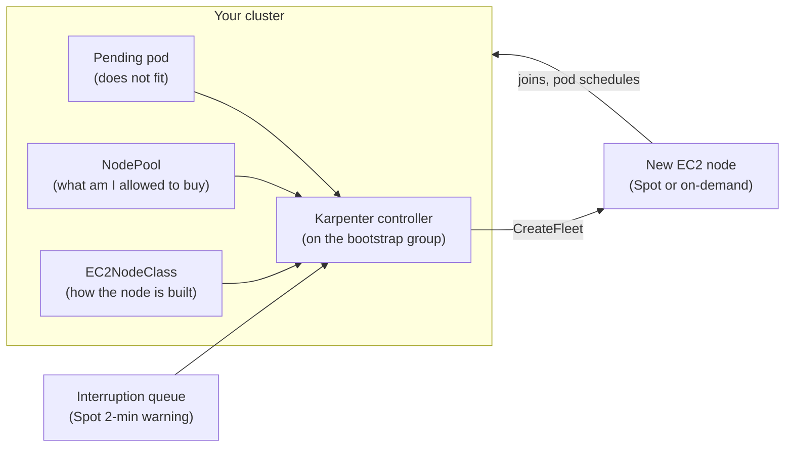

# Episode 5: Karpenter and node autoscaling

## Why this episode

Last week you stood up a cluster with a small bootstrap node group. Two `t3.large` nodes, fixed, just enough to host the system pods. That was always a placeholder. Your app cannot run on two small nodes. Hand-sizing an Auto Scaling group for real traffic is a job nobody wants. This week Karpenter takes over the data plane. You deploy a workload. Karpenter looks at the pods that will not fit and brings up exactly the nodes they need in under a minute. Scale the workload down and it packs the survivors together and deletes what is now empty.

This is the episode that delivers the project line:

> Karpenter for node autoscaling

By the end the bootstrap group goes back to doing one job, hosting Karpenter and CoreDNS, while everything else your project runs lands on nodes Karpenter chose.

The trap tonight, same shape as last week:

> Do not wire in `terraform-aws-modules/eks//modules/karpenter`. You write the controller IAM, the interruption queue and the associations yourself. The rubric grades your module.

## What you walk out with

- A mental model of how Karpenter picks instances and why it is quicker and tighter than the old Cluster Autoscaler.
- Your own `modules/karpenter`: the controller role on Pod Identity, the Spot interruption queue, the subnet and security-group discovery tags, the Helm release.
- A `NodePool` and an `EC2NodeClass` that turn "pods need capacity" into real EC2.
- Workloads scheduling onto Karpenter nodes, then watching consolidation reclaim them when you scale down.
- The scar tissue from flipping the consolidation policy and feeling the trade between cost and churn.

## Prerequisites

You need last week's cluster reachable:

```bash
aws eks update-kubeconfig --name eks-accel-dev --region eu-west-2
kubectl get nodes          # two bootstrap nodes, Ready
kubectl get pods -n kube-system   # coredns, aws-node, kube-proxy, ebs-csi Running
```

You also need three outputs from earlier sessions, which the tfvars example lists: the cluster name, the node role ARN from EP4 (`terraform output node_role_arn`) and the private subnet ids from EP3.

Tools, on top of last week's:

```bash
helm version    # >= 3.14: brew install helm
```

## The shape of the problem

Karpenter sits between unschedulable pods and the EC2 API. It watches the scheduler. The moment a pod cannot be placed, it decides what to launch.



Read three things off this before we build:

- **Karpenter is groupless.** The old Cluster Autoscaler drove Auto Scaling groups, so you pre-declared every instance shape as its own group and it scaled them in fixed steps. Karpenter has no node groups. It reads the pending pods and calls `CreateFleet` for the exact shape that fits, choosing from a wide pool of instance types.
- **Two objects govern it.** A `NodePool` is the policy, what Karpenter is allowed to buy and how it may disrupt. An `EC2NodeClass` is the AWS detail, how a node is built and where it attaches. You will meet both below.
- **Karpenter runs on the bootstrap group, never on itself.** It is a Deployment that must live somewhere stable it does not manage. That somewhere is last week's managed node group. This is the whole reason that group exists.

> Editable diagram: [`diagrams/ep5-karpenter-flow.drawio`](diagrams/ep5-karpenter-flow.drawio). Three pages: the provisioning loop, the identity and discovery wiring and the disruption lifecycle.

## 1. How Karpenter thinks

**The provisioning loop.** Karpenter watches for pods the scheduler has marked unschedulable. It batches them for a moment, works out the smallest set of nodes that would fit them given your NodePool rules, then launches that set through a single `CreateFleet` call. When the node joins, the normal scheduler places the pods. From pending pod to running is routinely 40 to 60 seconds, because Karpenter goes straight to the EC2 fleet API rather than nudging an Auto Scaling group.

**Bin-packing is the point.** Because Karpenter chooses the instance after it has read the pods, it can pick a shape that fits them snugly. Ten pods that each want 1 vCPU get one node with the headroom for ten, not three oversized nodes from a group you guessed at months ago. Tighter packing is fewer nodes, which is less money.

**Why it replaces Cluster Autoscaler.** They solve the same problem from opposite ends.

| | Cluster Autoscaler | Karpenter |
|---|---|---|
| Unit of scaling | Auto Scaling group you predefine | No groups, picks instances per pod set |
| Instance choice | Fixed per group | Any type that fits, from a broad pool |
| Speed to Ready | Minutes, ASG then join | Tens of seconds, fleet API then join |
| Bin-packing | Weak, bound by group shapes | Strong, shape chosen for the pods |
| Consolidation | Bolt-on, limited | First-class, built in |
| Best for | Legacy clusters mid-migration | New clusters, which is you |

> **What is bin-packing?** Fitting a set of pods, each with a CPU and memory request, onto the fewest and smallest nodes that hold them. It is the same idea as packing a suitcase. Karpenter is good at it because it chooses the suitcase after it has seen the clothes.

## 2. NodePool and EC2NodeClass

Two custom resources drive everything. Keeping them straight is half the session.

**The NodePool is the policy.** It says what Karpenter may provision and how it may take nodes away. The important parts:

- `requirements`: the allowed instance space, expressed as well-known labels. Capacity type (Spot, on-demand), architecture, instance category and generation. Wide requirements give Karpenter room to find cheap capacity. Narrow ones tie its hands.
- `limits`: a ceiling on total CPU and memory this NodePool may bring up. This is your runaway-cost seatbelt.
- `disruption`: when Karpenter is allowed to remove or replace a node. Covered in section 5.
- `template.spec.nodeClassRef`: which EC2NodeClass to build the node from.

```yaml
apiVersion: karpenter.sh/v1
kind: NodePool
metadata:
  name: general
spec:
  template:
    spec:
      requirements:
        - key: karpenter.sh/capacity-type
          operator: In
          values: ["spot", "on-demand"]
        - key: kubernetes.io/arch
          operator: In
          values: ["amd64"]
        - key: karpenter.k8s.aws/instance-category
          operator: In
          values: ["c", "m", "r"]
        - key: karpenter.k8s.aws/instance-generation
          operator: Gt
          values: ["4"]
      nodeClassRef:
        group: karpenter.k8s.aws
        kind: EC2NodeClass
        name: default
      expireAfter: 720h        # replace nodes after 30 days so AMIs stay fresh
  limits:
    cpu: "100"
    memory: 200Gi
  disruption:
    consolidationPolicy: WhenEmptyOrUnderutilized
    consolidateAfter: 1m
    budgets:
      - nodes: "10%"
```

**The EC2NodeClass is the AWS detail.** It says how a node is built: the AMI and IAM role, plus the subnets and security groups it attaches to.

```yaml
apiVersion: karpenter.k8s.aws/v1
kind: EC2NodeClass
metadata:
  name: default
spec:
  role: "eks-accel-dev-node"          # reuse the EP4 node role
  amiSelectorTerms:
    - alias: al2023@latest            # pinned family, latest patched AMI
  subnetSelectorTerms:
    - tags:
        karpenter.sh/discovery: "eks-accel-dev"
  securityGroupSelectorTerms:
    - tags:
        karpenter.sh/discovery: "eks-accel-dev"
```

Two things in that EC2NodeClass earn their own sections, because they are where clusters silently fail to scale: the `role` and the `karpenter.sh/discovery` tags. Section 3 wires both.

## 3. Wiring it up: identity, discovery, the join

This is the plumbing that makes the difference between "Karpenter launches an instance" and "Karpenter launches an instance that actually joins and runs pods". Three pieces.

**The controller needs its own IAM. We use Pod Identity.** Karpenter calls the EC2 and pricing APIs, so its pod needs an IAM role. Back in EP4 we said pod-level identity was coming and that Pod Identity is where AWS now steers new clusters. This is where it lands. You install the EKS Pod Identity Agent (the fifth addon we flagged). Then you create a role the Karpenter service account can assume and bind them with a Pod Identity association. No OIDC provider, no `aws-auth`.

> **The line that earns the mark on identity.** The Karpenter controller runs on Pod Identity. It does not borrow node-role permissions or carry a static key. The service account `karpenter` in `kube-system` is bound to a dedicated role through an `aws_eks_pod_identity_association`. It is least privilege and it needs no OIDC provider. IRSA is the older route and still valid. Pod Identity is the one to reach for on a 2026 cluster.

**Getting Karpenter nodes to join changed with access entries.** Here is the gotcha that catches everyone who followed an older tutorial. On a cluster in `aws-auth` mode, the node role was mapped in the ConfigMap and any node using it could join. Your EP4 cluster is on access entries in `API` mode, so a node only joins if its role has an `EC2_LINUX` access entry. Because we reuse the EP4 managed-node-group role, whose access entry EKS already made, Karpenter nodes join with nothing extra. Give Karpenter a brand new node role instead and the instances boot then sit there forever, never appearing in `kubectl get nodes`, with no obvious error. If you ever use a separate Karpenter node role, you add the `EC2_LINUX` access entry yourself.

**Karpenter finds subnets and security groups by tag.** The `subnetSelectorTerms` and `securityGroupSelectorTerms` above match on `karpenter.sh/discovery: eks-accel-dev`. Nothing in EP3 or EP4 set that tag, so the module adds it: a `karpenter.sh/discovery` tag on each private subnet and on the cluster security group. Miss this and Karpenter has nowhere to place nodes, so it logs that it found zero subnets and never launches anything. It is the single most common "why is nothing scaling" cause.

## 4. Deploy Karpenter, prove it, watch it pack

Provision the module, apply the two custom resources, then make some pods and watch nodes appear.

```bash
cd 05-karpenter/terraform/envs/dev
cp terraform.tfvars.example terraform.tfvars
# fill in cluster_name, node_role_arn (EP4 output), private_subnet_ids (EP3 output),
# cluster_security_group_id (EP4 output)

terraform init
terraform apply        # addon, IAM, SQS, discovery tags, Helm release

kubectl get pods -n kube-system -l app.kubernetes.io/name=karpenter
# karpenter-xxxx   Running   (on a bootstrap node)

# apply the NodePool and EC2NodeClass (edit the cluster name and node role first)
kubectl apply -f ../../k8s/ec2nodeclass.yaml
kubectl apply -f ../../k8s/nodepool.yaml
```

Now create demand. This deployment does nothing but reserve CPU, which is the quickest way to force a node.

```bash
kubectl apply -f ../../k8s/inflate.yaml     # 0 replicas, 1 vCPU each
kubectl scale deployment inflate --replicas=20

# watch Karpenter react
kubectl get nodeclaims -w
# NAME            TYPE        CAPACITY   NODE                    READY
# general-abcde   c6g...      spot       ip-10-0-...             True   ~45s

kubectl get nodes -L karpenter.sh/capacity-type
# the new node shows capacity-type=spot
```

Twenty pods that could not fit on two `t3.large` nodes just pulled a right-sized Spot node out of the air in under a minute.

### Now break it on purpose

Scale the workload to zero and watch consolidation clean up.

```bash
kubectl scale deployment inflate --replicas=0
kubectl get nodeclaims -w
# the Karpenter node goes away within a minute or two, empty nodes get consolidated
```

Then flip one lever in the NodePool and feel the trade. Change `consolidationPolicy` from `WhenEmptyOrUnderutilized` to `WhenEmpty`:

```bash
# edit k8s/nodepool.yaml: consolidationPolicy: WhenEmpty
kubectl apply -f ../../k8s/nodepool.yaml
```

Now Karpenter only removes a node when it is completely empty. Scale `inflate` up then partway down and watch: with `WhenEmpty` the half-used nodes sit there costing money, with `WhenEmptyOrUnderutilized` Karpenter would have repacked the pods and killed a node. That is the core tension of the session. Aggressive consolidation saves money and moves your pods around. Gentle consolidation is calm and more expensive. You are choosing where on that line your project sits.

## 5. Disruption and Spot

A node can leave for four reasons. Know all four, because three of them are Karpenter acting on purpose and one is AWS taking the node back.

- **Consolidation.** Karpenter decides the workload fits on fewer or cheaper nodes and repacks. `WhenEmpty` only removes empty nodes. `WhenEmptyOrUnderutilized` also replaces underused ones with something smaller. `consolidateAfter` sets how long it waits before acting.
- **Drift.** The node no longer matches its NodePool or EC2NodeClass, for example a newer AMI is out or you changed the spec. Karpenter replaces it to bring it back in line.
- **Expiry.** `expireAfter` forces a node to be replaced after a set age, 30 days here, so you are never running month-old AMIs with stale patches.
- **Interruption.** AWS is reclaiming a Spot node and gives a two-minute warning. It can also be a scheduled maintenance or health event. This is the one you do not control, which is why the interruption queue matters.

**Spot is most of the saving. The interruption queue is how you take it safely.** A Spot instance is spare EC2 capacity at up to about 90% off on-demand. In London an `m5.large` on-demand is around `$0.111` an hour. The same node on Spot often runs near `$0.03`. AWS can take it back with two minutes' notice. The module wires an SQS queue fed by EventBridge. When that warning arrives, Karpenter drains the node and launches a replacement before the old one dies. Without the queue your pods just get killed when the Spot node vanishes.

> **The line that earns the mark.** Spot first with on-demand fallback in one NodePool, an interruption queue so reclaims are graceful, `consolidationPolicy: WhenEmptyOrUnderutilized` for cost, plus a disruption budget and PodDisruptionBudgets so consolidation never takes too much at once. That sentence is the defensible core of a Karpenter setup. It is what the live review asks you to explain.

**Budgets and PDBs are the brakes.** Consolidation and drift move real pods. A disruption budget on the NodePool (`nodes: "10%"`) caps how many nodes Karpenter may disrupt at once. A PodDisruptionBudget on each workload caps how many of its pods can go down together. Set both. Without them, a burst of consolidation can briefly take out more of your app than you meant. For a pod that must never be moved mid-flight, the annotation `karpenter.sh/do-not-disrupt: "true"` takes it out of scope entirely.

## Pitfalls

- **Reaching for the upstream `karpenter` submodule.** The rubric says your own module. Write the controller role, the Pod Identity association, the SQS queue and the discovery tags yourself. You will be asked to explain each in the review.
- **No `karpenter.sh/discovery` tags.** Karpenter logs that it found zero subnets and launches nothing. The nodes never come because it has nowhere to put them. Tag the private subnets and the cluster security group.
- **A fresh Karpenter node role with no access entry.** On an access-entries cluster the instance boots and never joins, with no loud error. Reuse the EP4 node role. Or add an `EC2_LINUX` access entry for the new one.
- **Running Karpenter on a Karpenter node.** If the controller lands on a node it manages, consolidation or a Spot reclaim can take out Karpenter itself. Pin it to the bootstrap group with a `karpenter.sh/nodepool DoesNotExist` affinity.
- **A NodePool with no `limits`.** One bad Deployment with a huge replica count and Karpenter will happily buy a wall of nodes. The `limits` block is the ceiling that stops a mistake becoming an invoice.
- **Spot with no interruption queue.** It works in a demo and bites in production, because reclaims kill pods with no drain. Wire the queue on day one.
- **Consolidation with no budgets or PDBs.** Karpenter repacks aggressively and briefly takes down more of a workload than you expected. Cap it at both levels.
- **Narrow `requirements`.** Pin to a single instance type and you have handed back most of what Karpenter is for, including Spot diversity. Give it a category and a generation floor, then let it choose.

## Homework

1. **Build your own `modules/karpenter`.** No upstream Karpenter module. The Pod Identity Agent addon, the controller role and association, the interruption queue with its EventBridge rules, the discovery tags, the Helm release. Be ready to explain every resource.
2. **Stand it up and prove autoscaling.** `terraform apply`, apply your NodePool and EC2NodeClass, scale a workload and screenshot `kubectl get nodeclaims` showing a Spot node going `Ready` in under a minute.
3. **Do the consolidation drill.** Scale down and watch nodes go away. Then flip `WhenEmptyOrUnderutilized` to `WhenEmpty` and back. Write one sentence on which you would run for your project and why.
4. **Add a PodDisruptionBudget** to one of your app deployments and a `nodes` budget to your NodePool. Explain in your project README what each one protects.
5. **Shrink the bootstrap group.** Now Karpenter carries the load, drop the EP4 managed node group to the minimum that holds Karpenter and CoreDNS. Note the before and after node count.

Bring a cluster that scales on demand, plus the sentence from step 3, to the next session.

## Appendix A: CoderCo's Technical Vocab (CTV) Dictionary

Skip what you know.

- **Karpenter**: an open-source node autoscaler for Kubernetes that provisions right-sized EC2 nodes directly, without Auto Scaling groups.
- **NodePool**: the Karpenter object that sets what Karpenter may buy and how it may disrupt nodes, limits included.
- **EC2NodeClass**: the Karpenter object that says how a node is built: AMI, IAM role, subnets, security groups.
- **NodeClaim**: Karpenter's record of a single node it has requested. Watch these to see provisioning happen.
- **Bin-packing**: fitting pods onto the fewest, smallest nodes that hold them. Karpenter's core saving.
- **Consolidation**: Karpenter removing or replacing nodes when the workload fits on fewer or cheaper ones.
- **Drift**: a node no longer matching its NodePool or EC2NodeClass, which triggers a replacement.
- **Expiry (`expireAfter`)**: forcing a node to be replaced after a set age so AMIs stay current.
- **Interruption**: AWS reclaiming a node, most often a Spot two-minute warning, handled through the interruption queue.
- **Interruption queue**: an SQS queue fed by EventBridge that lets Karpenter drain a node gracefully before AWS takes it.
- **Spot**: spare EC2 capacity at a steep discount that AWS can reclaim with two minutes' notice.
- **Disruption budget**: a cap on how many nodes Karpenter may disrupt at once.
- **`karpenter.sh/do-not-disrupt`**: a pod annotation that takes a pod out of scope for voluntary disruption.
- **Discovery tag**: the `karpenter.sh/discovery` tag Karpenter uses to find your subnets and security groups.
- **Pod Identity**: per-pod IAM through an agent addon and an association, the mechanism the Karpenter controller uses here.

See you in episode 6, where the app grows a memory: EBS-backed storage and a Postgres running inside the cluster.
