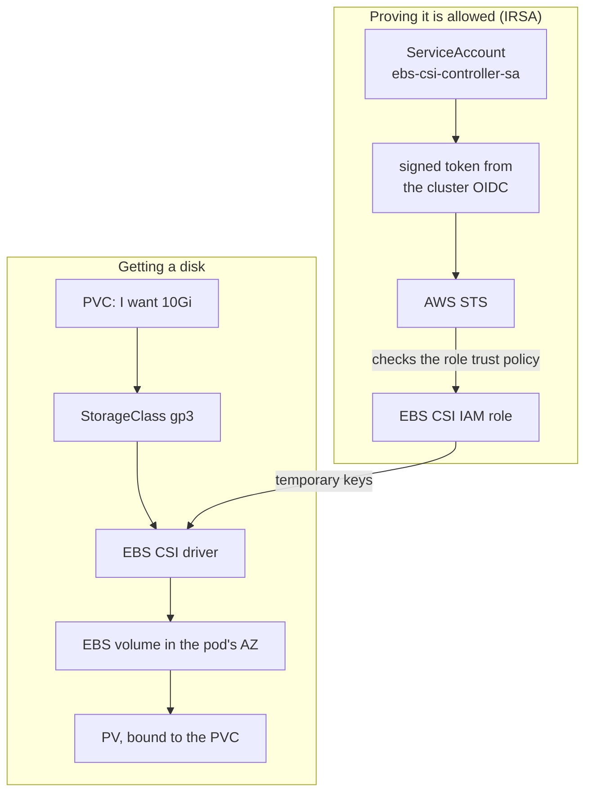

# Episode 6: Storage and pod-level IAM

## This episode

Everything you have run so far has been stateless. Kill a pod and it comes back with a blank disk. Nobody minds. Next week you run Postgres, which minds a great deal. A database that forgets everything when its pod restarts is not a database. So this week you give the cluster real, durable storage on AWS. You also teach one pod how to prove who it is to AWS, so it can manage that storage safely.

Two things ship tonight. Real disks that survive a pod restart, backed by EBS. And the first proper piece of pod-level IAM in the project, wired the classic way with IRSA.

This delivers the project line:

> gp3 as the default storage class, IRSA wired up for EBS CSI, snapshots working

Back in EP4 you installed the EBS driver but took a shortcut: you let it borrow the node's permissions. Tonight you take that shortcut out and give the driver its own identity, the right way.

> The trap, same as always. No `terraform-aws-modules` for the IAM. You write the OIDC provider, the role and the trust policy yourself, because the whole point tonight is understanding how that trust works.

## What storage is

New to this? Start here. A container has its own little disk, but that disk is throwaway. When the container is replaced, which in Kubernetes happens all the time, the disk goes with it. Fine for a web server that keeps nothing. A disaster for a database.

So Kubernetes lets a pod ask for a disk that lives separately from it and outlives it. On AWS that disk is an **EBS volume**, a real block device you could think of as a USB drive that Amazon plugs into whichever server your pod lands on. If the pod moves, the drive gets unplugged and plugged back in next to it.

Three words you will hear all night:

- A **PersistentVolumeClaim** (PVC) is a pod saying "I need a 10Gi disk, please". It is a request.
- A **StorageClass** is the vending machine that fulfils the request. It knows how to go to AWS and create the actual EBS volume.
- A **PersistentVolume** (PV) is the disk you got back, now bound to your claim.

You write the PVC. The StorageClass and the PV mostly take care of themselves. That hands-off creation is called **dynamic provisioning**. It is the normal way to do storage on EKS.

## Today

- An understanding of PVCs, StorageClasses and the EBS volumes underneath them.
- A `gp3` StorageClass set as the cluster default, plus a `gp3-retain` one for data you never want deleted by accident.
- The EBS driver running on its own IAM role through IRSA, with the EP4 node-role shortcut removed.
- A clear picture of how IRSA actually works, earned by breaking it on purpose and reading the error.
- A snapshot of a volume taken and restored into a fresh disk, so next week's database has a backup story.

## Prerequisites

Your EP5 cluster, reachable, with Karpenter running:

```bash
kubectl get nodes                              # bootstrap nodes plus any Karpenter nodes
kubectl get pods -n kube-system | grep ebs     # ebs-csi-controller and node pods Running
kubectl get sc                                 # you probably have a gp2 default from EKS
```

You also need the cluster's OIDC issuer URL from EP4 (`terraform output oidc_issuer_url`) and the EBS driver already installed, which it is from EP4.

> New to Kubernetes storage? Warm up on the local Kind lab in [`lab/`](lab/README.md) first. It covers the whole storage half on your laptop, no AWS needed.

## The problem

Two flows meet tonight. One is a pod asking for a disk. The other is the driver proving it is allowed to make one.



Read two things off this before we build:

- **The disk is created only when a pod actually needs it.** That one setting is what keeps EBS working across three AZs. Section 2.
- **The driver has no AWS keys of its own.** It borrows a role for a few minutes at a time by proving which service account it is. That proof is IRSA. Section 3.

> Editable diagram: [`diagrams/ep6-storage.drawio`](diagrams/ep6-storage.drawio). Three pages: the provisioning flow, the IRSA trust chain and the snapshot-restore path.

## 1. StorageClass, PV and PVC

**The PVC is a request, the PV is what you get, the StorageClass decides how.** You almost never create a PV by hand. You write a PVC that names a StorageClass and a size. The StorageClass goes and makes the volume. That is dynamic provisioning.

Here is a whole PVC, the only piece you actually write:

```yaml
apiVersion: v1
kind: PersistentVolumeClaim
metadata:
  name: data
spec:
  accessModes: ["ReadWriteOnce"]
  storageClassName: gp3
  resources:
    requests:
      storage: 10Gi
```

`ReadWriteOnce` is the **access mode**. It means one node may mount this disk at a time. That is simply how EBS works: a volume attaches to a single server, so two pods on different nodes cannot share one EBS disk. When you genuinely need shared storage, that is a different AWS service (EFS) and a different day. For a database, one-node-at-a-time is exactly what you want.

A StorageClass, the vending machine the PVC names, looks like this:

```yaml
apiVersion: storage.k8s.io/v1
kind: StorageClass
metadata:
  name: gp3
  annotations:
    storageclass.kubernetes.io/is-default-class: "true"
provisioner: ebs.csi.aws.com
volumeBindingMode: WaitForFirstConsumer
reclaimPolicy: Delete
allowVolumeExpansion: true
parameters:
  type: gp3
  iops: "3000"
  throughput: "125"
  encrypted: "true"
```

`provisioner: ebs.csi.aws.com` is the line that matters most. It names the **CSI driver**, the plugin that lets Kubernetes go off and create real AWS disks. `ebs.csi.aws.com` is the EBS one, the driver you installed back in EP4. A StorageClass with no working driver behind it just leaves your PVC waiting forever.

The `parameters` are the EBS settings. `gp3` is the current general-purpose SSD, cheaper and faster than the old `gp2`. `iops` (input/output operations per second) and `throughput` (megabytes per second) are the two dials for how fast the disk is. On gp3 you set them directly. `encrypted: "true"` encrypts the volume at rest, which you always want. `allowVolumeExpansion: true` lets you grow the disk later without recreating it.

**`reclaimPolicy` decides what happens to the disk when you delete the claim.** `Delete` throws the EBS volume away with the PVC. `Retain` keeps it, so a fumbled `kubectl delete` does not wipe your data. You will ship both: `gp3` with `Delete` as the default for scratch space, plus `gp3-retain` with `Retain` for anything that matters, like a database.

## 2. The AZ issue

This is the setting that separates a storage class that works from one that fails at 2am. It is worth the whole section.

An EBS volume lives in one Availability Zone (an AZ, one of the separate datacentres in the region you met in EP3). It can only attach to a server in that same zone. Now remember EP5: Karpenter puts nodes in whichever of your three AZs makes sense, so you do not know up front where your pod will land.

Put those together. If the StorageClass creates the volume the moment you write the PVC (`volumeBindingMode: Immediate`), it guesses an AZ. Then the pod gets scheduled. Karpenter lands it in a different AZ, so the volume cannot attach. The pod hangs forever with a `FailedAttachVolume` event and a message about the volume being in the wrong zone.

`volumeBindingMode: WaitForFirstConsumer` fixes it. The StorageClass waits until a pod is actually scheduled, sees which AZ it landed in, then creates the volume there.

> **The line that earns the mark on storage.** Every EBS StorageClass uses `volumeBindingMode: WaitForFirstConsumer`. EBS volumes are zonal, your nodes are spread across zones, so binding the disk before the pod is placed is how you get a volume stranded in the wrong AZ. Set it once and the whole class of AZ-attach failures disappears.

## 3. Pod permissions with IRSA

New to AWS permissions? Start here. AWS lets nothing touch its services by default. Every call, "create a volume" or "read this bucket", is checked against IAM, its permission system. So the EBS driver cannot make a disk until AWS is convinced it is allowed to.

The way you grant that is a **role**: a named bundle of permissions that something can borrow for a short while. Borrowing it is called **assuming** the role. What you get back is a set of **temporary credentials**, keys that work for about an hour then expire. Nothing keeps a permanent password in a file, so there is no key to leak or rotate.

So the question is how a pod, just a container in your cluster, proves to AWS that it may assume the EBS role. In EP5 you met one answer, Pod Identity, which you gave Karpenter. Tonight you learn the older one, **IRSA**, IAM Roles for Service Accounts. You learn it because it is everywhere, from the guides you will read to the tools that still require it.

**You have used the trick before.** When a website offers "Log in with Google", it never sees your password. It trusts Google to vouch for you. IRSA is the same move: you teach AWS to trust your cluster to vouch for which pod is asking. That trust relationship is an **OIDC provider**. It is the first of the four parts.

Here is the whole model in four moving parts:

- **The OIDC provider.** Your cluster can sign short-lived tokens that say "this token belongs to service account X in namespace Y". You register the cluster as an OIDC identity provider in IAM, so AWS is willing to listen to those tokens. You create this once per cluster.
- **The IAM role.** A normal role, holding the permissions the driver needs.
- **The trust policy on that role.** This is the heart of it. It says "the only thing allowed to assume me is service account `ebs-csi-controller-sa` in `kube-system`, proven by a token from this cluster's OIDC provider". Nothing else can become this role.
- **The service account annotation.** The service account is tagged with the role's ARN, so the driver's pods know which role to ask for. An ARN is just the unique id of any AWS resource, like `arn:aws:iam::123456789012:role/eks-accel-dev-ebs-csi`.

The flow at runtime: the driver's pod presents its signed token to AWS STS, the token desk that swaps a proof of identity for temporary keys. STS checks the token against the role's trust policy. The service account matches, so STS hands back temporary keys that last about an hour. No stored secret anywhere.

> **What is a service account?** An identity for a pod inside Kubernetes, the way a user account is an identity for a person. IRSA is the bridge that turns that in-cluster identity into an AWS identity.

> **The important part about identity.** The EBS driver runs on its own IAM role, scoped by a trust policy to exactly one service account, assumed through the cluster OIDC provider. The node-role shortcut from EP4 comes off. Least privilege, giving a thing only the access it needs, means the driver can touch EBS and nothing else can touch the driver's role.

**IRSA or Pod Identity?** For a brand new cluster, Pod Identity is the simpler default and the way AWS is steering. IRSA is the one you must still understand, because the whole ecosystem is built on it and you will read trust policies like this for years. That is why we wire EBS the IRSA way here and break it open in the deep dive.

## 4. Wire the driver

Two changes turn the shortcut into the real thing:

1. Tell the EBS addon to use the new role. In your EP4 `aws_eks_addon.ebs_csi`, set `service_account_role_arn` to the role this module outputs. EKS annotates `ebs-csi-controller-sa` for you.
2. Take `AmazonEBSCSIDriverPolicy` off the node role in EP4. The driver no longer needs the node's permissions. Leaving the policy there would undo the least-privilege win.

Apply EP4 again. The driver restarts using its own role. Nothing else changes.

## 5. Snapshots and restore

A snapshot is a point-in-time copy of an EBS volume, kept in AWS. Kubernetes drives them through three objects that mirror the storage ones:

- A **VolumeSnapshotClass** is the vending machine, like a StorageClass but for snapshots.
- A **VolumeSnapshot** is your request to snapshot a specific PVC.
- A **VolumeSnapshotContent** is the actual snapshot in AWS that you got back.

One catch: EKS does not ship the piece that watches for these objects. You install the **CSI snapshot controller** and its CRDs once (a CRD, Custom Resource Definition, is how you teach Kubernetes a new object type like VolumeSnapshot; the controller comes from the `external-snapshotter` project, v8). After that, restoring is lovely. You create a new PVC with a `dataSource` pointing at a VolumeSnapshot. It comes up pre-loaded with the snapshot's data.

That is next week's backup story in miniature, rehearsed tonight on a throwaway 1Gi volume.

## Deep dive: watch IRSA work, then break it

Provision the module, then prove the trust chain with your own eyes.

```bash
cd 06-storage/terraform/envs/dev
terraform init && terraform apply     # OIDC provider, EBS role, a small demo role

# apply the storage classes and the IRSA demo pod
kubectl apply -f ../../k8s/storageclass-gp3.yaml
kubectl apply -f ../../k8s/storageclass-gp3-retain.yaml
kubectl apply -f ../../k8s/irsa-demo.yaml

# the demo pod runs `aws sts get-caller-identity`. Look at who it became.
kubectl logs job/irsa-demo
# "Arn": "arn:aws:sts::...:assumed-role/eks-accel-dev-irsa-demo/botocore-session-..."
```

That ARN is the proof. A pod with no AWS keys became an IAM role, because its service account token matched the role's trust policy.

### Now break it on purpose

Change the trust policy so it expects a different service account, then re-run:

```bash
# in the module, change the demo trust's service account to "wrong-sa", then:
terraform apply
kubectl delete job irsa-demo && kubectl apply -f ../../k8s/irsa-demo.yaml
kubectl logs job/irsa-demo
# An error occurred (AccessDenied) ... is not authorized to perform
# sts:AssumeRoleWithWebIdentity
```

Read that error slowly, because you will see it for the rest of your career. It means the token was valid but the trust policy said no: the service account in the token did not match the one the role trusts. Put the name back and apply. The pod becomes the role again. IRSA lives or dies on the trust policy, the part that says who may assume the role.

## Pitfalls

- **Forgetting `volumeBindingMode: WaitForFirstConsumer`.** The PVC binds a volume in one AZ, the pod lands in another, so it hangs on `FailedAttachVolume`. The commonest storage bug on EKS. The fix is one line.
- **Two default StorageClasses.** EKS ships a `gp2` default. Mark `gp3` default without removing the flag from `gp2` and you have two, which Kubernetes will not thank you for. Take the default annotation off `gp2`.
- **Leaving the node-role shortcut in place.** If you add the IRSA role but forget to remove `AmazonEBSCSIDriverPolicy` from the node role, the driver still works, so you will not notice. The over-broad permission just quietly stays. Remove it and confirm the driver still provisions.
- **A trust policy with the wrong service account or namespace.** One typo in `system:serviceaccount:kube-system:ebs-csi-controller-sa` and every volume operation fails with `AccessDenied` on `AssumeRoleWithWebIdentity`. The name in the trust must match the annotated service account exactly.
- **`reclaimPolicy: Delete` on data you cared about.** Delete the PVC, the EBS volume goes with it, the data is gone. Use `gp3-retain` for anything you would miss.
- **Snapshots with no controller.** You apply a VolumeSnapshot and nothing happens, no error, because the snapshot controller is not installed. Install `external-snapshotter` first.

## Homework

1. **Build your own `modules/storage`.** The OIDC provider, the EBS CSI IRSA role with its trust policy, the small demo role. No upstream module for the IAM.
2. **Ship gp3 as default and remove the gp2 default.** Prove it with `kubectl get sc` showing `gp3 (default)` and `gp2` with no default marker.
3. **Wire the driver to its role and pull the shortcut.** Update the EP4 addon and node role, apply, then show the EBS controller pod running with the role annotation.
4. **Do the break-it drill yourself.** Capture the `AssumeRoleWithWebIdentity` `AccessDenied` error, then fix it. Write one sentence on what the trust policy checks.
5. **Snapshot and restore.** Install the snapshot controller, snapshot a 1Gi PVC that has a file on it, restore into a new PVC, then show the file is there.

Bring a cluster with a default gp3 class, the driver on its own role and a restored volume to the next session.

## Appendix A: CoderCo's Technical Vocab (CTV) Dictionary

Skip what you know.

- **PersistentVolumeClaim (PVC)**: a pod's request for a disk of a given size and class.
- **PersistentVolume (PV)**: the actual disk that satisfies a claim.
- **StorageClass**: the template that provisions volumes dynamically. Names the driver and the disk settings.
- **Dynamic provisioning**: the volume being created automatically from a PVC, with no hand-made PV.
- **Access mode**: how a volume may be mounted. `ReadWriteOnce` is one node at a time, which is all EBS supports.
- **CSI driver**: the plugin that lets Kubernetes create real storage on a provider. `ebs.csi.aws.com` is the EBS one.
- **EBS volume**: an AWS disk (a block device). Lives in one Availability Zone.
- **`volumeBindingMode: WaitForFirstConsumer`**: wait until a pod is scheduled before creating the volume, so it lands in the pod's AZ.
- **`reclaimPolicy`**: what happens to the disk when the claim is deleted. `Delete` or `Retain`.
- **gp3**: the current general-purpose EBS SSD. Cheaper than gp2 and lets you tune IOPS and throughput.
- **IAM**: the AWS permission system. Every call to AWS is checked against it.
- **IAM role**: a named bundle of permissions that something can assume for a short while.
- **Assuming a role**: borrowing its permissions, getting back temporary keys that expire.
- **STS**: AWS Security Token Service. Swaps a proof of identity for temporary credentials.
- **ARN**: Amazon Resource Name, the unique id of any AWS resource.
- **IRSA (IAM Roles for Service Accounts)**: giving a pod an AWS role through the cluster OIDC provider and a trust policy.
- **OIDC provider**: the cluster registered in IAM as a signer of identity tokens, so AWS trusts tokens it issues.
- **Trust policy**: the part of an IAM role that says who is allowed to assume it. For IRSA, one service account.
- **VolumeSnapshot**: a point-in-time backup of a PVC, taken through the CSI snapshot controller.
- **VolumeSnapshotClass**: the template for taking snapshots, like a StorageClass for backups.
- **CRD (Custom Resource Definition)**: how you teach Kubernetes a new object type, like VolumeSnapshot.

---

Thank you for attending this session and see you in the next! 
