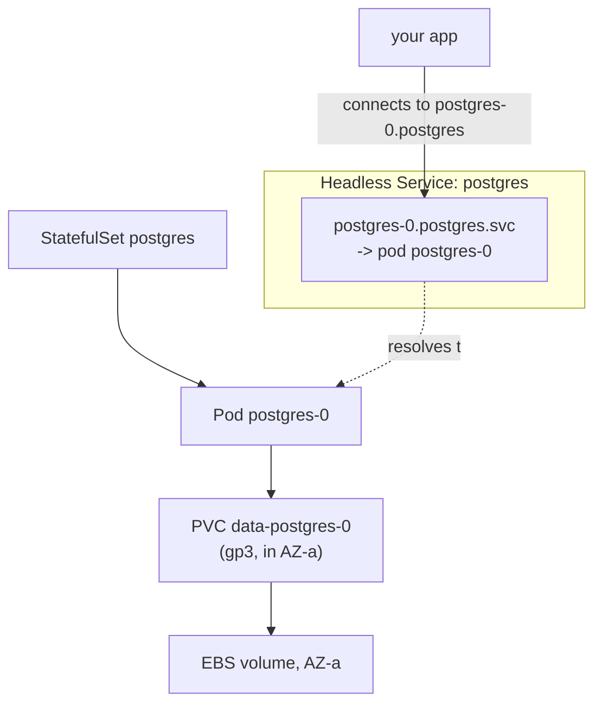

# Episode 7: Postgres and Redis that remember

## This episode

Last week you built storage. This week something finally uses it. Your app needs a database for its data and a cache for speed. Both have to survive a pod being killed or a node being drained. A web pod can die and nobody notices. A database pod that comes back empty is a disaster.

The tool for running things that must keep their data and their name is the **StatefulSet**. Tonight you run Postgres and Redis on StatefulSets, each with its own disk from EP6. You also meet the one hard problem that EBS and Kubernetes create together: what happens when a database pod tries to move to another Availability Zone.

This delivers the project line:

> Postgres and Redis running in-cluster on StatefulSets, data surviving a pod restart

> The trap: reaching for the Bitnami Postgres chart. As of late 2025 its free images are gone (more on that in section 3). You write your own StatefulSet, because the point is understanding how stateful workloads actually work.

## What a StatefulSet is, plainly

New to this? Start here. You already know a **Deployment**: it runs N identical pods with random names and treats them as interchangeable. Kill one and another takes its place. Nobody cares which is which. Perfect for a stateless web server.

A database is not interchangeable. The pod holding your data is special. It has to keep the same identity and the same disk every time it restarts. If you run more than one, they come up in order. That is what a **StatefulSet** gives you:

- **A stable name.** The pods are `postgres-0`, `postgres-1`, `postgres-2`, not random. `postgres-0` is always `postgres-0`.
- **Its own disk, forever.** Each pod gets its own PersistentVolumeClaim that follows its name. `postgres-0` always reattaches to the exact same disk, restart after restart.
- **Order.** Pods start `0`, then `1`, then `2`. They shut down in reverse. A database replica set cares about this.

The mental model: a Deployment's pods are temp staff, any one will do and they wear no name badge. A StatefulSet's pods have an assigned desk with a name plate and a locked drawer that is always theirs.

## What you walk out with

- A clear sense of when to use a StatefulSet instead of a Deployment.
- Postgres running on a StatefulSet, with its own disk, surviving a pod delete with the data intact.
- Redis (Valkey) running the same way, with append-only persistence and a password from a Secret.
- The DNS names your app uses to reach a specific database pod.
- A defensible answer to the AZ-pinning problem, earned by watching a pod fail to move across zones.

## Prerequisites

Your EP6 cluster, with the `gp3` default StorageClass and the EBS driver on its own role:

```bash
kubectl get sc                 # gp3 (default)
kubectl get pods -n kube-system | grep ebs   # controller Running
```

> New to StatefulSets? Warm up on the local Kind lab in [`lab/`](lab/README.md) first. It runs Postgres and Redis on your laptop and shows stable identity, per-pod disks and data surviving a restart, no AWS needed.

## The problem

Two ideas do the work tonight: a stable identity for each pod and a disk welded to it.



Read two things off this before we build:

- **One disk per pod, welded to the name for good.** `postgres-0` and `data-postgres-0` are a married pair. Section 1.
- **That disk lives in one Availability Zone.** So the pod is quietly tied to that zone too. Moving it is the hard problem. Section 5.

> Editable diagram: [`diagrams/ep7-stateful.drawio`](diagrams/ep7-stateful.drawio). Three pages: StatefulSet identity, headless DNS and the AZ-pinning problem.

## 1. StatefulSet vs Deployment

The difference that matters is the disk. A Deployment either has no storage or shares one volume across all its pods. A StatefulSet gives each pod its own, through a **volumeClaimTemplate**: a PVC stamped out per pod and named after it.

```yaml
apiVersion: apps/v1
kind: StatefulSet
metadata:
  name: postgres
spec:
  serviceName: postgres        # the headless Service, section 2
  replicas: 1
  selector:
    matchLabels: { app: postgres }
  template:
    metadata:
      labels: { app: postgres }
    spec:
      containers:
        - name: postgres
          image: postgres:18
          # ...
          volumeMounts:
            - name: data
              mountPath: /var/lib/postgresql/data
  volumeClaimTemplates:
    - metadata:
        name: data
      spec:
        accessModes: ["ReadWriteOnce"]
        storageClassName: gp3
        resources:
          requests:
            storage: 20Gi
```

That `volumeClaimTemplates` block is the whole point. It creates a PVC called `data-postgres-0` for the first pod, `data-postgres-1` for the second and so on. Delete `postgres-0` and the StatefulSet makes a new pod with the same name, which reattaches to the same `data-postgres-0`. The data is still there. That is what a Deployment cannot do.

## 2. The headless Service and stable DNS

A normal Service gives you one virtual IP and load-balances across the pods behind it. That is wrong for a database, where you need to reach a **specific** instance, the primary, by name.

A **headless Service** (`clusterIP: None`) does the opposite. It creates no virtual IP. Instead it gives every pod its own DNS name:

```
postgres-0.postgres.default.svc.cluster.local
```

Read that right to left: the cluster, the `default` namespace, the `postgres` Service, the `postgres-0` pod. Your app connects to that name and always reaches that exact pod, wherever it is running.

> **What is a headless Service?** A Service with `clusterIP: None`. A normal Service is one phone number that rings whoever is free. A headless Service gives each pod its own direct line, which is what you want when the pods are not interchangeable.

## 3. Running Postgres

You have three ways to run Postgres on Kubernetes. In 2026 the choice is clearer than the old tutorials suggest.

| Option | What it is | Verdict |
|---|---|---|
| Bitnami chart | The Helm chart every old guide uses | Avoid. Bitnami removed its free images in September 2025, so the chart now fails to pull |
| Your own manifest | A StatefulSet you write | Best for learning and a single instance. What we build tonight |
| CloudNativePG | A Postgres operator | Best for production: failover, backups, replicas across AZs |

**The Bitnami trap is real and current.** Broadcom moved the Bitnami catalog to a paid model in late 2025 and deleted the free versioned images from Docker Hub. A `bitnami/postgresql` chart that worked last year now gives `ImagePullBackOff` the moment a pod reschedules. If you follow a 2023 tutorial tonight you will hit it. Do not.

> **The line that earns the mark on Postgres.** For learning and a single instance, write your own StatefulSet, so you understand every line. For production, run CloudNativePG, because failover, point-in-time backups and cross-AZ replicas are its whole job and hand-rolling them is a mistake. The Bitnami chart is not a 2026 option.

Our Postgres StatefulSet is one replica, with its password coming from a Kubernetes Secret. That Secret is a plain one tonight. Next week you replace it with External Secrets, so the password lives in AWS Secrets Manager instead of a base64 string in your repo.

One detail that catches everyone: point `PGDATA` at a subdirectory of the mount rather than the mount root, because the disk arrives with a `lost+found` folder that Postgres refuses to initialise into.

## 4. Running Redis

Redis needs the same treatment: a StatefulSet, its own disk, a password.

**We run Valkey, the open-source fork of Redis. Here is why.** Redis changed its licence in 2024, so the community forked it into **Valkey**, now run by the Linux Foundation under a permissive BSD licence. Valkey speaks the exact same protocol, so your app cannot tell the difference. It is also the default that AWS ElastiCache now offers. On a 2026 cluster Valkey is the sane pick. Your app still says "Redis", the wire is identical.

Two settings matter for a cache that should survive a restart:

- **Append-only persistence** (`--appendonly yes`). Redis and Valkey can write every change to a log on disk, so a restart replays the log and the data comes back. Without it, a restart is a blank cache.
- **A password** (`--requirepass`), pulled from a Secret, so nothing on the network can talk to it unauthenticated.

Redis holds less than Postgres, so give it a smaller disk. A pitfall below is copying the 20Gi template onto everything.

## 5. The AZ-pinning problem

Here is the hard one. It is the mark of the night. An EBS volume lives in one Availability Zone (EP6). A StatefulSet pod is welded to its volume. So the pod is welded to that zone, even though nothing in the YAML says so.

Now the failure. A node dies or you drain it. Kubernetes tries to reschedule `postgres-0`. If the scheduler picks a node in a different AZ, the pod comes up and tries to attach `data-postgres-0`, but cannot, because the volume is in the old zone. The pod hangs `Pending` with a volume node-affinity conflict. Your database is down until a node frees up in the right zone.

Three ways to deal with it:

- **Pin the pod to its zone.** Node affinity on `topology.kubernetes.io/zone` keeps `postgres-0` in the AZ its volume lives in. It always reschedules where the disk is. The cost: that one AZ is now a single point of failure for the database.
- **Replicate across zones with an operator.** CloudNativePG runs one Postgres per AZ, each with its own EBS volume in its own zone, then fails over between them. This is the real high-availability answer. It is why the operator exists.
- **EFS as an escape hatch.** EFS is a shared filesystem that spans all AZs, so a pod can attach it from anywhere. Tempting, but a poor fit for a database. It is slower and pricier than EBS, without the low-latency fsync Postgres wants. We do not pick it.

> **The line that earns the mark.** A single-instance database on EBS lives in one AZ. You have two honest choices. Pin the pod to that AZ and accept it as the failure domain. Or run replicas across AZs with an operator. Do not stretch one EBS volume across zones or reach for EFS to dodge the problem. Say which you chose and why.

## Deep dive: kill the pod, then move it

Stand up Postgres, prove the data survives a normal restart, then force the AZ problem.

```bash
kubectl apply -f k8s/postgres/
kubectl rollout status statefulset/postgres

# write some data
kubectl exec -it postgres-0 -- psql -U app -d app -c "create table t(x int); insert into t values (42);"

# kill the pod. the StatefulSet brings it straight back.
kubectl delete pod postgres-0
kubectl rollout status statefulset/postgres
kubectl exec -it postgres-0 -- psql -U app -d app -c "select * from t;"
# 42, still there. same pod name, same disk.
```

### Now move it across zones on purpose

```bash
# which node and AZ is postgres-0 on?
kubectl get pod postgres-0 -o wide
kubectl get nodes -L topology.kubernetes.io/zone

# cordon every node in that AZ, then delete the pod so it must move
kubectl cordon <the-nodes-in-that-AZ>
kubectl delete pod postgres-0

kubectl get pod postgres-0            # Pending
kubectl describe pod postgres-0 | tail
# ... volume node affinity conflict: the volume is in the wrong zone
```

There it is. The pod cannot follow its disk across the AZ boundary. Uncordon the nodes and it recovers. That five-minute experiment is the whole reason the AZ decision matters. It is what the live review asks you to explain.

## Pitfalls

- **Reaching for the Bitnami chart.** Its free images are gone since September 2025. A `bitnami/postgresql` pod fails to pull the moment it reschedules. Write your own StatefulSet or use CloudNativePG.
- **Using a Deployment for a database.** No stable name, no per-pod disk. Two replicas fight over one volume or come up empty. Databases are StatefulSets.
- **`PGDATA` at the mount root.** The EBS volume arrives with a `lost+found` directory, so Postgres refuses to initialise into it. Point `PGDATA` at a subdirectory.
- **One 20Gi template for everything.** Redis holds far less than Postgres. Right-size each StatefulSet's volume rather than copying the Postgres block.
- **Assuming the pod can move zones.** It cannot: its EBS volume is zonal. Plan for the pod staying in one AZ. Or replicate across zones with an operator.
- **A password baked into the manifest in plain sight.** Tonight's Secret is a stopgap. It is base64, not encryption. Next week it moves to AWS Secrets Manager through External Secrets.
- **No persistence on Redis.** Without `--appendonly yes` a restart wipes the cache. Turn it on for anything you would miss.

## Homework

1. **Write your own Postgres StatefulSet.** Headless Service, StatefulSet with a volumeClaimTemplate, a Secret for the password. No Bitnami, no operator. Be ready to explain every field.
2. **Write the Redis (Valkey) StatefulSet.** Append-only persistence on, password from a Secret, a right-sized disk.
3. **Prove the data survives.** Write a row, delete `postgres-0`, show the row is still there after it comes back.
4. **Force the AZ problem.** Cordon the nodes in the pod's AZ, delete the pod, capture the `Pending` and the node-affinity conflict, then recover it. Write one sentence on how you would run this in production.
5. **Point your app at the databases.** Wire one of your services to `postgres-0.postgres` and the Redis Service, then show it reading and writing.

Bring Postgres and Redis both surviving a pod delete, plus the AZ paragraph, to the next session.

## Appendix A: CoderCo's Technical Vocab (CTV) Dictionary

Skip what you know.

- **StatefulSet**: runs pods with stable names, each with its own disk, in order. For databases and anything that keeps state.
- **Deployment**: runs interchangeable, replaceable pods with no stable identity. For stateless apps.
- **volumeClaimTemplate**: the StatefulSet field that stamps out a per-pod PVC, named after the pod.
- **Headless Service**: a Service with `clusterIP: None` that gives each pod its own DNS name instead of one shared IP.
- **Stable network identity**: the fixed DNS name a StatefulSet pod keeps, like `postgres-0.postgres`.
- **CloudNativePG**: a Kubernetes operator that runs Postgres in production, with failover and backups.
- **Valkey**: the open-source, BSD-licensed fork of Redis. Same protocol, the default on AWS now.
- **Append-only file (AOF)**: Redis and Valkey writing every change to a disk log, so data survives a restart.
- **AZ-pinning**: a StatefulSet pod being tied to one Availability Zone because its EBS volume lives there.

See you in episode 8, where that plain password stops being a base64 string in your repo and starts living in AWS Secrets Manager, synced in by External Secrets.
